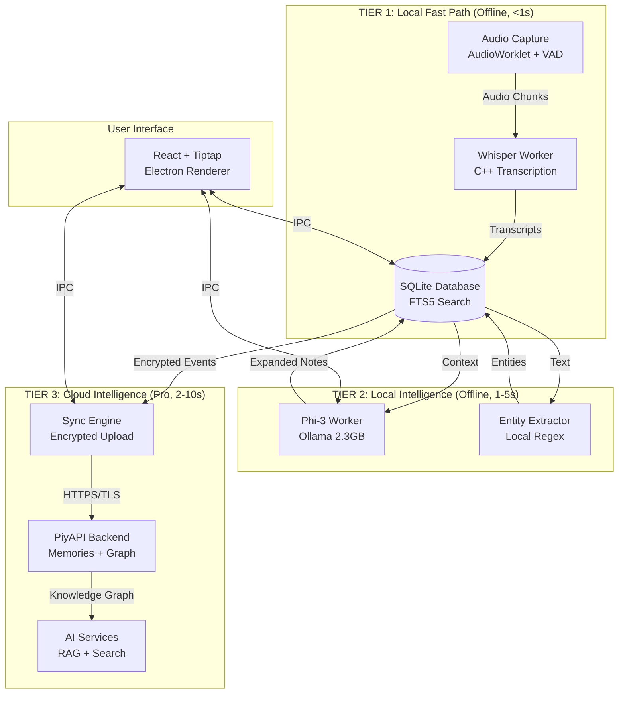
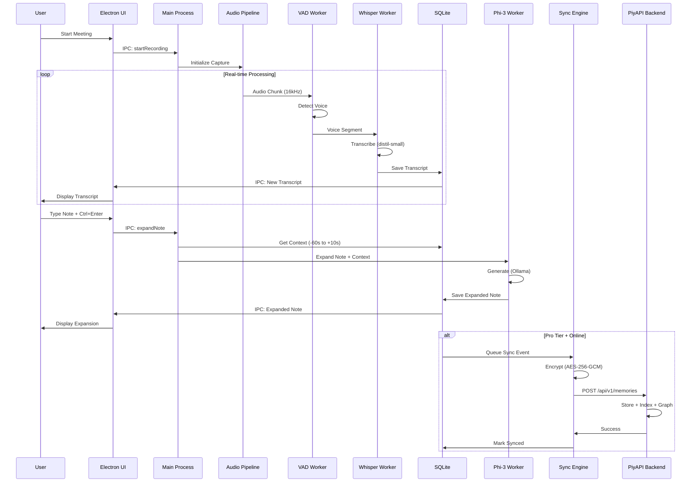
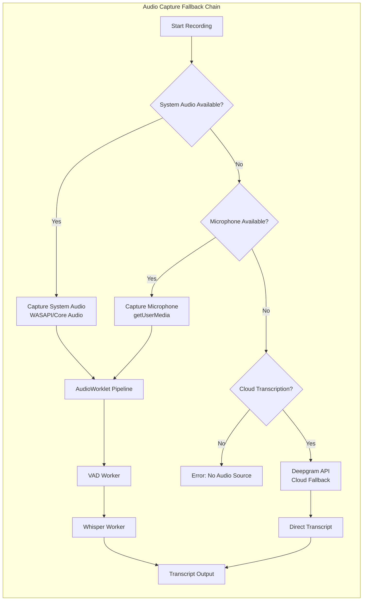
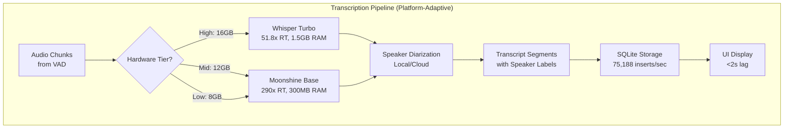
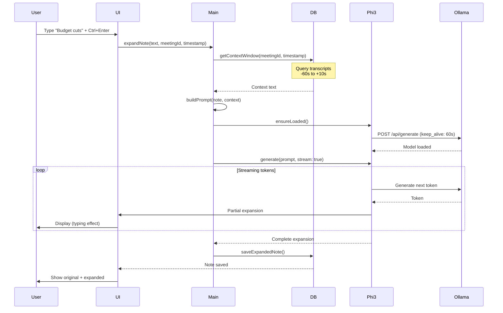
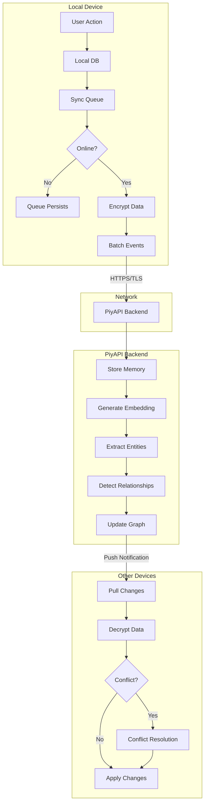
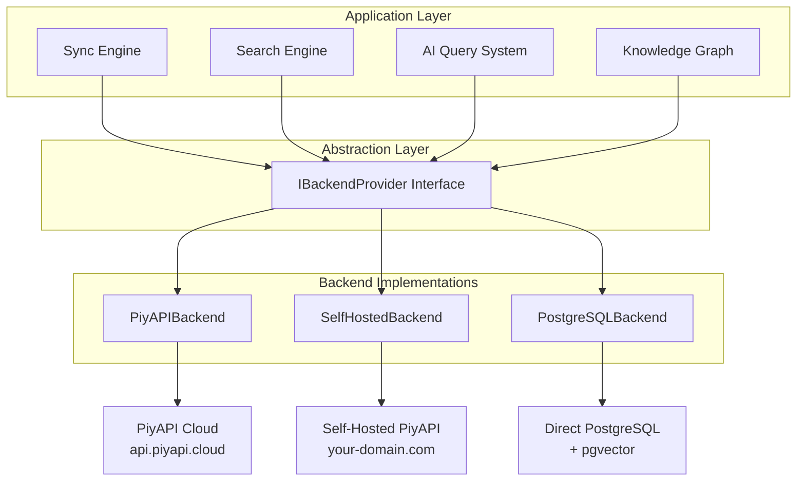
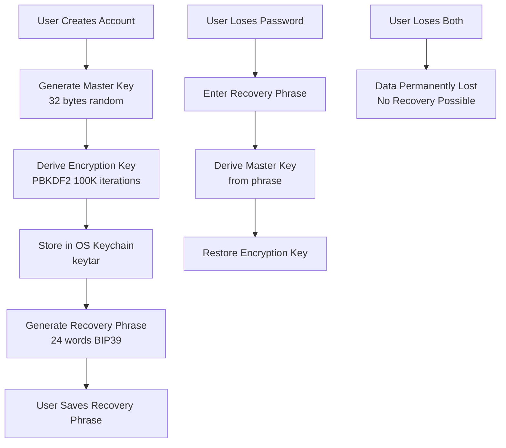
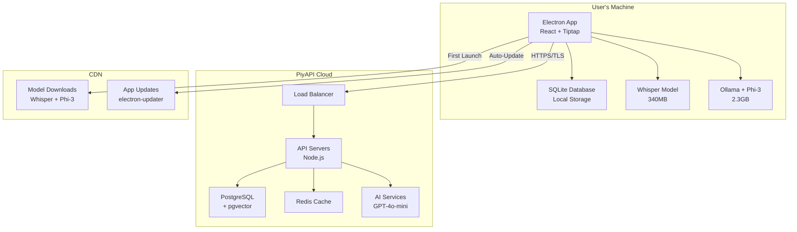

# Design Document: PiyAPI Notes

## Introduction

PiyAPI Notes is a local-first meeting transcription application that combines privacy-focused local processing with optional cloud intelligence. This design document specifies the technical architecture, component interactions, data models, and implementation details required to build a production-ready system.

### Design Philosophy

1. **Local-First**: Core functionality (transcription, note-taking, AI expansion) works 100% offline
2. **Privacy by Default**: Audio never leaves device unencrypted; client-side encryption before cloud sync
3. **Progressive Enhancement**: Free tier is fully functional; paid tiers add cloud features
4. **Graceful Degradation**: Fallback chains ensure functionality even when components fail
5. **Performance-Conscious**: Optimized for 8GB RAM machines with lazy-loading and resource management

### Key Innovations

- **Three-Tier Intelligence**: Local fast path → Local AI → Cloud intelligence
- **Zero-Cost Free Tier**: All processing on user's hardware = $0 operational cost
- **Platform-Adaptive Inference**: MLX (Apple Silicon, 53 t/s) vs Ollama (cross-platform, 36-37 t/s)
- **Dual LLM Strategy**: Qwen 2.5 3B for action items (score 18), Llama 3.2 3B for JSON extraction (score 21)
- **Moonshine Eliminates Mutual Exclusion**: At 300MB RAM, Moonshine + LLM run concurrently on all tiers
- **Streaming-First LLM**: Time-to-first-token <200ms, no blocking waits
- **Knowledge Graph**: Auto-detected meeting relationships (follows, contradicts, references)
- **Trojan Horse Strategy**: Free tier creates data lock-in, paid tiers monetize power users
- **Validated Performance**: All metrics from M4 benchmarks (Whisper turbo 51.8x RT, Moonshine 290x RT, SQLite 75,188 inserts/sec)

---

## System Architecture

### Three-Tier Intelligence Model

PiyAPI Notes is organized into three intelligence tiers. This architecture ensures core functionality works 100% offline (Tier 1 + 2) while paid tiers add cloud intelligence (Tier 3).

**TIER 1: Local Fast Path (Offline, <1s latency)**
- Audio Capture (AudioWorklet + VAD Worker)
- Whisper Worker (Whisper turbo 51.8x RT on 16GB) OR Moonshine Worker (290x RT on 8-12GB)
- SQLite Database (FTS5 Search, 75,188 inserts/sec, <1ms search)
- Works: 100% offline, instant response
- Free tier: ✅ Full access

**TIER 2: Local Intelligence (Offline, streaming with <200ms TTFT)**
- Platform-Adaptive Inference Engine (MLX 53 t/s on Apple Silicon, Ollama 36-37 t/s cross-platform)
- Dual LLM Strategy: Qwen 2.5 3B (action items) + Llama 3.2 3B (JSON extraction)
- Local Entity Extraction (Regex-based)
- Features: Note expansion (Ctrl+Enter), auto-titling, action item extraction
- Works: 100% offline, requires local models, streaming tokens in real-time
- Free tier: ✅ Full access

**TIER 3: Cloud Intelligence (Pro tier, 2-10s latency)**
- PiyAPI Backend (Memories + Knowledge Graph)
- AI Services (RAG, Semantic Search, Contradiction Detection)
- Compliance Engine (GDPR, HIPAA, SOC 2)
- Works: Requires internet connection
- Free tier: ❌ Not available
- Paid tiers: ✅ Optional enhancement

### High-Level Architecture (Three-Tier Model)



### Component Interaction Flow



---

## Component Design

### 1. Audio Capture System

**Purpose**: Capture system audio and microphone input with platform-specific APIs and fallback chain.

**Architecture**:



**Key Components**:

1. **Platform-Specific Capture**
   - Windows: WASAPI (Windows Audio Session API) via `desktopCapturer`
   - macOS: ScreenCaptureKit (requires Screen Recording permission)
   - Fallback: Microphone via `getUserMedia` API

2. **AudioWorklet Pipeline**
   - Modern API (replaces deprecated ScriptProcessorNode)
   - Runs on dedicated audio thread (prevents glitches)
   - Processes audio in 128-sample frames at 16kHz

3. **VAD Worker Thread**
   - Silero VAD model (<1MB, ONNX runtime)
   - Detects voice activity with 95% accuracy
   - Reduces transcription workload by 40%
   - <10ms inference time per chunk

4. **Pre-Flight Audio Test**
   - Runs before first meeting
   - Tests system audio, microphone, and permissions
   - Provides platform-specific guidance if failures occur

**Implementation Details**:

```typescript
interface AudioCaptureConfig {
  platform: 'win32' | 'darwin';
  preferredSource: 'system' | 'microphone' | 'cloud';
  sampleRate: 16000;
  channelCount: 1; // Mono
  chunkDuration: 30; // seconds
}

interface AudioChunk {
  data: Float32Array;
  timestamp: number;
  hasVoice: boolean;
  confidence: number;
}
```

**Error Handling**:
- System audio failure → Retry with microphone
- Microphone failure → Offer cloud transcription (Deepgram)
- All failures → Display platform-specific guidance
- Log all failures for diagnostics

---

### 2. Transcription Engine

**Purpose**: Convert audio to text using platform-adaptive ASR models with speaker diarization and performance optimization.

**Hardware Tier Auto-Detection (Updated with Validated Benchmarks)**:

```typescript
// src/main/services/HardwareTier.ts
interface HardwareTier {
  tier: 'low' | 'mid' | 'high';
  asrEngine: 'whisper-turbo' | 'moonshine-base';
  llmModel: 'qwen2.5:3b' | 'qwen2.5:1.5b';
  llmMaxTokens: number;
  chunkSizeSeconds: number;
  concurrentModels: boolean;
  totalRAMBudget: string;
}

function detectTier(): HardwareTier {
  const ramGB = os.totalmem() / 1024 ** 3;
  
  if (ramGB >= 16) {
    return {
      tier: 'high',
      asrEngine: 'whisper-turbo',    // 1.5GB RAM, 51.8x RT, best accuracy
      llmModel: 'qwen2.5:3b',         // 2.2GB RAM, 53 t/s (MLX) or 36 t/s (Ollama)
      llmMaxTokens: 300,
      chunkSizeSeconds: 10,
      concurrentModels: true,         // 1.5 + 2.2 + 0.8 = 4.5GB ✅
      totalRAMBudget: '4.5GB'
    };
  } else if (ramGB >= 12) {
    return {
      tier: 'mid',
      asrEngine: 'moonshine-base',   // 300MB RAM, 290x RT, 12% WER
      llmModel: 'qwen2.5:3b',         // 2.2GB RAM
      llmMaxTokens: 200,
      chunkSizeSeconds: 10,
      concurrentModels: true,         // 0.3 + 2.2 + 0.8 = 3.3GB ✅
      totalRAMBudget: '3.3GB'
    };
  } else { // 8GB
    return {
      tier: 'low',
      asrEngine: 'moonshine-base',   // 300MB RAM
      llmModel: 'qwen2.5:1.5b',       // 1.1GB RAM
      llmMaxTokens: 100,
      chunkSizeSeconds: 15,
      concurrentModels: true,         // 0.3 + 1.1 + 0.8 = 2.2GB ✅ No swapping!
      totalRAMBudget: '2.2GB'
    };
  }
}
```

**Key Insight**: By using Moonshine Base (300MB) on mid/low tiers instead of Whisper (1.5GB), **all three tiers now run both ASR and LLM concurrently**. The complex ResourceManager mutual exclusion is only needed for the high tier.

**Architecture**:



**Key Components**:

1. **Platform-Adaptive ASR Selection**
   - High tier (16GB+): Whisper turbo (1.5GB RAM, 51.8x real-time, best accuracy)
   - Mid tier (12GB): Moonshine Base (300MB RAM, 290x real-time, 12% WER)
   - Low tier (8GB): Moonshine Base (300MB RAM, 290x real-time, 12% WER)
   - Benchmark on first launch to classify machine

2. **Whisper Turbo Worker (High Tier)**
   - Model: ggml-turbo.bin (1.6GB on disk, ~1.5GB RAM)
   - Speed: 51.8x real-time on M4 (30s audio → 0.58s processing)
   - Accuracy: Equivalent to Whisper Large V3
   - RAM: ~1.5GB during transcription
   - Validated benchmark: 10s chunk processes in ~0.2s

3. **Moonshine Base Worker (Mid/Low Tier)**
   - Model: Moonshine Base ONNX (~250MB on disk, ~300MB RAM)
   - Speed: 290x real-time (10s audio → 34ms processing)
   - Accuracy: 12% WER (acceptable for meeting notes)
   - RAM: ~300MB during transcription
   - **Eliminates mutual exclusion**: Can run concurrently with LLM on all tiers

4. **Performance Tier Detection**
   - Benchmark on first launch (10s audio sample)
   - Classify by available RAM, not speed
   - High: 16GB+ → Whisper turbo
   - Mid: 12GB → Moonshine Base
   - Low: 8GB → Moonshine Base
   - Display performance tier to user in settings

5. **Speaker Diarization**
   - Local: pyannote.audio for 1-2 speakers (2GB model)
   - Cloud: Deepgram API for 3+ speakers
   - Speaker labels: "Speaker 1", "Speaker 2", etc.
   - Pro tier: Allow renaming speakers ("Speaker 1" → "Sarah")

6. **Chunking Strategy**
   - 10-second chunks for processing (improved from 30s)
   - Overlap: 2 seconds between chunks (prevents word cutoff)
   - Buffer management: Max 5 chunks in memory (50 seconds)
   - Reduces latency by 3x compared to 30s chunks

**Implementation Details**:

```typescript
interface TranscriptionConfig {
  model: 'distil-small' | 'cloud';
  language: 'en';
  wordTimestamps: true;
  temperature: 0.0; // Deterministic
  threads: 4; // Max CPU threads
}

interface TranscriptSegment {
  id: string;
  meetingId: string;
  startTime: number; // seconds
  endTime: number;
  text: string;
  confidence: number;
  speakerId: string;
  words: Word[];
}

interface Word {
  word: string;
  start: number;
  end: number;
  confidence: number;
}
```

**Performance Optimization**:
- Lazy model loading (load on first use)
- Model stays loaded during meeting
- Unload after meeting ends (free 1.2GB RAM)
- Use quantized model (q5_0) for 40% size reduction

---

### 3. Note Expansion System

**Purpose**: Expand user notes using platform-adaptive LLM inference with dual model strategy and streaming-first architecture.

**Context Window Strategy (Dual-Path)**:

The application uses two different approaches for context retrieval based on user tier and connectivity:

**Option A: PiyAPI Context Sessions API (Pro/Team/Enterprise + Online)**
- Semantic retrieval (not just time-based slicing)
- Automatic token budgeting for Qwen's 8-32K context window
- Multi-turn context accumulation
- Replaces ~80 lines of manual context management with 5-line API call

**Option B: Local SQL Fallback (Free tier / Offline)**
- Time-based slicing (-60s to +10s around note timestamp)
- Simple SQL query for transcript segments
- Works 100% offline

```typescript
// src/main/services/NoteExpansionService.ts
private async getContextWindow(meetingId: string, noteText: string, timestamp: number): Promise<string> {
  // Option A: PiyAPI Context Sessions (Pro users with sync enabled)
  if (await this.hasCloudAccess()) {
    const session = await fetch(`${API_BASE}/api/v1/context/sessions`, {
      method: 'POST',
      headers: {
        'Authorization': `Bearer ${this.accessToken}`,
        'Content-Type': 'application/json'
      },
      body: JSON.stringify({
        namespace: 'meetings.transcripts',
        token_budget: 2048,
        time_range: { start: timestamp - 60, end: timestamp + 10 },
        filters: { meeting_id: meetingId }
      })
    }).then(r => r.json());
    
    const contextData = await fetch(
      `${API_BASE}/api/v1/context/retrieve?session_id=${session.context_session_id}&query=${encodeURIComponent(noteText)}`,
      {
        headers: { 'Authorization': `Bearer ${this.accessToken}` }
      }
    ).then(r => r.json());
    
    return contextData.context;
  }
  
  // Option B: Local fallback (Free users / offline)
  const segments = await this.db.all(`
    SELECT text FROM transcripts
    WHERE meeting_id = ? AND start_time >= ? AND end_time <= ?
    ORDER BY start_time ASC
  `, [meetingId, timestamp - 60, timestamp + 10]);
  
  return segments.map(s => s.text).join(' ');
}

/**
 * Check if user has cloud access (Pro/Team/Enterprise plan with sync enabled)
 * Used to determine Context Sessions API vs local SQL fallback
 */
private async hasCloudAccess(): Promise<boolean> {
  try {
    const token = await keytar.getPassword('piyapi-notes', 'access-token');
    if (!token) return false;
    const plan = await keytar.getPassword('piyapi-notes', 'plan-tier');
    return plan !== 'free' && navigator.onLine;
  } catch {
    return false;
  }
}
```

**Benefits of Context Sessions API**:
1. Semantic retrieval finds relevant context, not just temporally adjacent segments
2. Automatic token budgeting prevents context overflow
3. Excludes silence-filled transcript segments
4. Simpler code (~5 lines vs ~80 lines)
5. Multi-turn context accumulation for better expansions

**Platform-Adaptive Inference Engine**:

```typescript
// src/main/services/InferenceEngine.ts
interface InferenceEngine {
  generate(prompt: string, opts: GenerateOptions): AsyncIterable<Token>;
  load(model: string): Promise<void>;
  unload(): Promise<void>;
  getRAMUsage(): number;
  getTokensPerSecond(): number;
}

// Factory — picks the fastest engine for the platform
function createInferenceEngine(): InferenceEngine {
  if (process.platform === 'darwin' && isAppleSilicon()) {
    return new MLXEngine();     // 53 t/s — Apple native, validated benchmark
  } else {
    return new OllamaEngine();  // 36-37 t/s — cross-platform, validated benchmark
  }
}
```

**Dual LLM Strategy (Validated Benchmarks)**:

Based on structured output benchmarks on M4:
- **Qwen 2.5 3B**: Best for action items and bullet formatting (score 18 vs Llama's 11)
- **Llama 3.2 3B**: Best for JSON entity extraction (score 21 vs Qwen's 17)
- **Tied on summaries**: Both score 20 on meeting summaries

**Default Strategy**:
- Use Qwen 2.5 3B for note expansion (Ctrl+Enter)
- Use Llama 3.2 3B for entity extraction
- Both use identical RAM (~2.2GB for 3B, ~1.1GB for 1.5B)

**Streaming-First Architecture**:

```typescript
// ✅ CORRECT — Streaming (user sees text immediately)
const stream = await inference.generate({
  prompt, 
  model: 'qwen2.5:3b',
  stream: true, 
  max_tokens: 200  // Reduced from 500 based on benchmarks
});

for await (const chunk of stream) {
  editor.appendText(chunk.token); // First token appears in ~130ms (TTFT)
}

// ❌ WRONG — Blocking (user stares at spinner for 6+ seconds)
const result = await inference.generate({ 
  stream: false, 
  max_tokens: 500 
});
editor.setText(result);
```

**Architecture**:




**Key Components**:

1. **Qwen 2.5 3B Model (Default for Note Expansion)**
   - Size: 1.8GB on disk, 2.2GB RAM (3B) or 1.1GB RAM (1.5B)
   - Quality: Best at bullet formatting, assignees, dates (benchmark score: 18)
   - Speed: 36-53 tokens/sec (MLX: 53 t/s, Ollama: 36 t/s)
   - Time-to-first-token: ~130ms (validated benchmark)
   - Runs via MLX (Apple Silicon) or Ollama (cross-platform)

2. **Llama 3.2 3B Model (Entity Extraction)**
   - Size: 2.0GB on disk, 2.4GB RAM
   - Quality: Best at entity extraction, compact JSON (benchmark score: 21)
   - Speed: 37-53 tokens/sec (MLX: 53 t/s, Ollama: 37 t/s)
   - Use for: Entity extraction, structured data parsing

3. **Lazy Loading Strategy**
   - Model loads on first Ctrl+Enter press
   - Stays loaded for 60 seconds after last use
   - Auto-unloads to free 2.2GB RAM (3B) or 1.1GB RAM (1.5B)
   - Prevents OOM on 8GB machines

4. **Context Window**
   - Extracts transcript from -60s to +10s of note timestamp
   - Provides meeting context for accurate expansion
   - Limits context to 1000 tokens (prevents hallucination)

5. **Prompt Engineering**
   - Instructs to expand into 1-2 sentences
   - Requires using only provided context
   - Specifies professional third-person style
   - Limits output to 150-200 tokens max (reduced from 500 based on benchmarks)

6. **Streaming Implementation**
   - Stream tokens as they arrive (no blocking wait)
   - Display partial expansions in real-time
   - Time-to-first-token: <200ms (target based on ~130ms benchmark)
   - User sees immediate feedback (typing effect)

**Implementation Details**:

```typescript
interface NoteExpansionConfig {
  model: 'phi3:mini';
  temperature: 0.1; // Low for consistency
  topP: 0.9;
  topK: 40;
  maxTokens: 100;
  stopSequences: ['\n\n', 'USER'];
}

interface ExpandedNote {
  id: string;
  meetingId: string;
  timestamp: number;
  originalText: string;
  expandedText: string;
  context: string; // Transcript context used
  isAugmented: boolean;
  version: number;
}
```

**RAM Management**:
- Whisper (1.2GB) + Phi-3 (2.3GB) + Electron (0.8GB) = 4.3GB
- On 8GB machines: 4.3GB + OS (2GB) = 6.3GB (tight!)
- Solution: Unload Phi-3 after 60s idle → drops to 2GB

---

### 4. Local Storage (SQLite)

**Purpose**: Store meetings, transcripts, notes, and sync queue with ACID guarantees and full-text search.

**Schema Design**:

```sql
-- Core Tables
CREATE TABLE meetings (
  id TEXT PRIMARY KEY,
  title TEXT,
  start_time INTEGER NOT NULL,
  end_time INTEGER,
  duration INTEGER,
  participant_count INTEGER,
  tags TEXT, -- JSON array
  namespace TEXT DEFAULT 'default',
  created_at INTEGER DEFAULT (strftime('%s', 'now')),
  synced_at INTEGER DEFAULT 0,
  performance_tier TEXT -- 'fast', 'medium', 'slow'
);

CREATE TABLE transcripts (
  id TEXT PRIMARY KEY,
  meeting_id TEXT NOT NULL,
  start_time REAL NOT NULL,
  end_time REAL NOT NULL,
  text TEXT NOT NULL,
  confidence REAL,
  speaker_id TEXT,
  speaker_name TEXT, -- Pro tier: custom names
  words TEXT, -- JSON array of {word, start, end, confidence}
  created_at INTEGER DEFAULT (strftime('%s', 'now')),
  synced_at INTEGER DEFAULT 0,
  FOREIGN KEY (meeting_id) REFERENCES meetings(id) ON DELETE CASCADE
);

CREATE TABLE notes (
  id TEXT PRIMARY KEY,
  meeting_id TEXT NOT NULL,
  timestamp REAL NOT NULL,
  original_text TEXT NOT NULL,
  augmented_text TEXT,
  context TEXT, -- Transcript context
  is_augmented BOOLEAN DEFAULT 0,
  version INTEGER DEFAULT 1,
  created_at INTEGER DEFAULT (strftime('%s', 'now')),
  updated_at INTEGER DEFAULT (strftime('%s', 'now')),
  synced_at INTEGER DEFAULT 0,
  FOREIGN KEY (meeting_id) REFERENCES meetings(id) ON DELETE CASCADE
);

CREATE TABLE entities (
  id TEXT PRIMARY KEY,
  meeting_id TEXT NOT NULL,
  type TEXT NOT NULL, -- 'PERSON', 'DATE', 'AMOUNT', 'TOPIC'
  text TEXT NOT NULL,
  confidence REAL,
  start_offset INTEGER,
  end_offset INTEGER,
  transcript_id TEXT,
  created_at INTEGER DEFAULT (strftime('%s', 'now')),
  FOREIGN KEY (meeting_id) REFERENCES meetings(id) ON DELETE CASCADE,
  FOREIGN KEY (transcript_id) REFERENCES transcripts(id) ON DELETE CASCADE
);

CREATE TABLE sync_queue (
  id TEXT PRIMARY KEY,
  operation_type TEXT NOT NULL, -- 'create', 'update', 'delete'
  table_name TEXT NOT NULL,
  record_id TEXT NOT NULL,
  payload TEXT, -- JSON
  retry_count INTEGER DEFAULT 0,
  created_at INTEGER DEFAULT (strftime('%s', 'now')),
  last_attempt INTEGER
);

CREATE TABLE encryption_keys (
  id TEXT PRIMARY KEY,
  user_id TEXT NOT NULL,
  salt BLOB NOT NULL, -- 32 bytes
  recovery_phrase_hash TEXT, -- SHA-256 of recovery phrase
  created_at INTEGER DEFAULT (strftime('%s', 'now'))
);

-- Indexes
CREATE INDEX idx_transcripts_meeting ON transcripts(meeting_id);
CREATE INDEX idx_transcripts_time ON transcripts(meeting_id, start_time);
CREATE INDEX idx_notes_meeting ON notes(meeting_id);
CREATE INDEX idx_entities_meeting ON entities(meeting_id);
CREATE INDEX idx_entities_type ON entities(type);
CREATE INDEX idx_sync_queue_pending ON sync_queue(operation_type, retry_count);

-- Full-Text Search
CREATE VIRTUAL TABLE transcripts_fts USING fts5(
  text,
  content=transcripts,
  content_rowid=rowid
);

CREATE VIRTUAL TABLE notes_fts USING fts5(
  original_text,
  augmented_text,
  content=notes,
  content_rowid=rowid
);

-- FTS Triggers
CREATE TRIGGER transcripts_fts_insert AFTER INSERT ON transcripts BEGIN
  INSERT INTO transcripts_fts(rowid, text) VALUES (new.rowid, new.text);
END;

CREATE TRIGGER transcripts_fts_delete AFTER DELETE ON transcripts BEGIN
  INSERT INTO transcripts_fts(transcripts_fts, rowid, text) 
  VALUES ('delete', old.rowid, old.text);
END;

CREATE TRIGGER transcripts_fts_update AFTER UPDATE ON transcripts BEGIN
  INSERT INTO transcripts_fts(transcripts_fts, rowid, text) 
  VALUES ('delete', old.rowid, old.text);
  INSERT INTO transcripts_fts(rowid, text) VALUES (new.rowid, new.text);
END;
```

**Performance Optimizations**:

```typescript
// SQLite configuration
const db = new Database('piyapi-notes.db', {
  wal: true, // Write-Ahead Logging (concurrent reads)
  memory: 2000, // 2GB memory-mapped I/O
  synchronous: 'NORMAL', // Balanced safety/speed
  cacheSize: -64000, // 64MB cache
  tempStore: 'MEMORY'
});

// PRAGMA commands
db.pragma('journal_mode = WAL');
db.pragma('synchronous = NORMAL');
db.pragma('cache_size = -64000');
db.pragma('temp_store = MEMORY');
db.pragma('mmap_size = 2000000000');
```

**FTS5 Query Sanitization (Critical for Stability)**:

```typescript
// src/main/services/SearchService.ts
function sanitizeFTS5Query(raw: string): string {
  return raw
    .replace(/[-]/g, ' ')             // Hyphens crash FTS5
    .replace(/[*(){}[\]^~"]/g, '')    // Strip operators
    .split(/\s+/)
    .filter(w => w.length > 1)
    .map(w => `"${w}"`)              // Quote each term
    .join(' ');
}

// Example:
// Input:  "budget-cuts (2024)"
// Output: "\"budget\" \"cuts\" \"2024\""
```

**Expected Performance**:
- 75,188 inserts/second (validated benchmark on M4)
- Full-text search across 100,000 segments in <1ms average (validated benchmark)
- 1GB database file for ~200 hours of meetings
- Startup time: <3 seconds regardless of data volume

---

### 5. Sync Engine

**Purpose**: Synchronize meeting data across devices with encryption, conflict resolution, and offline support.

**Architecture**:




**Key Components**:

1. **Event-Sourced Sync**
   - Sync operations (events), not state
   - Each event: {type, table, record_id, data, timestamp, device_id}
   - Queue persists in SQLite (survives app crashes)
   - Batch up to 50 events per sync request

2. **Encryption Before Upload**
   - AES-256-GCM with unique IV per encryption
   - PBKDF2 key derivation (100,000 iterations)
   - Random salt stored with user account
   - Recovery phrase (24 words) for key recovery

3. **Conflict Resolution**
   - Vector clocks for causality tracking
   - Last-write-wins for simple conflicts
   - User prompt for complex conflicts (side-by-side diff)
   - Auto-resolve after 7 days (keep most recent)

4. **Exponential Backoff**
   - Retry failed syncs with exponential delay
   - Max delay: 30 seconds
   - Max retries: Infinite (queue persists)
   - User notification after 3 consecutive failures

**Implementation Details**:

```typescript
interface SyncEvent {
  id: string;
  timestamp: number;
  deviceId: string;
  operation: {
    type: 'transcript.create' | 'note.create' | 'note.update' | 'meeting.create';
    table: string;
    recordId: string;
    data: any;
  };
  synced: boolean;
  encrypted: boolean;
  retryCount: number;
}

interface EncryptedPayload {
  ciphertext: string; // Base64
  iv: string; // Base64, 12 bytes
  salt: string; // Base64, 32 bytes
  algorithm: 'aes-256-gcm';
}

interface VectorClock {
  [deviceId: string]: number; // Logical timestamp per device
}

interface ConflictResolution {
  type: 'local_newer' | 'remote_newer' | 'concurrent';
  localVersion: any;
  remoteVersion: any;
  resolvedVersion?: any;
}
```

**Sync Flow**:

1. User creates/updates data → Save to local DB
2. Queue sync event in `sync_queue` table
3. If online → Encrypt data → Batch events → POST to PiyAPI
4. If offline → Events remain in queue
5. When online → Resume sync automatically
6. On success → Delete from queue, mark `synced_at`
7. On failure → Increment `retry_count`, exponential backoff

**Encryption Key Management**:

```typescript
// Key derivation
async function deriveKey(password: string, salt: Uint8Array): Promise<CryptoKey> {
  const passwordKey = await crypto.subtle.importKey(
    'raw',
    new TextEncoder().encode(password),
    'PBKDF2',
    false,
    ['deriveBits']
  );
  
  const keyMaterial = await crypto.subtle.deriveBits(
    {
      name: 'PBKDF2',
      salt: salt,
      iterations: 100000,
      hash: 'SHA-256'
    },
    passwordKey,
    256
  );
  
  return crypto.subtle.importKey(
    'raw',
    keyMaterial,
    { name: 'AES-GCM' },
    false,
    ['encrypt', 'decrypt']
  );
}

// Encryption
async function encryptData(plaintext: string, key: CryptoKey): Promise<EncryptedPayload> {
  const iv = crypto.getRandomValues(new Uint8Array(12));
  const ciphertext = await crypto.subtle.encrypt(
    { name: 'AES-GCM', iv },
    key,
    new TextEncoder().encode(plaintext)
  );
  
  return {
    ciphertext: arrayBufferToBase64(ciphertext),
    iv: arrayBufferToBase64(iv),
    salt: '', // Retrieved from encryption_keys table
    algorithm: 'aes-256-gcm'
  };
}

// Recovery phrase generation (BIP39-style)
function generateRecoveryPhrase(): string[] {
  const entropy = crypto.getRandomValues(new Uint8Array(32)); // 256 bits
  return entropyToMnemonic(entropy); // 24 words
}
```

---

### 6. Backend Abstraction Layer

**Purpose**: Decouple application from PiyAPI backend to support alternative backends and self-hosting.

**Architecture**:



**Interface Definition**:

```typescript
interface IBackendProvider {
  // Authentication
  login(email: string, password: string): Promise<AuthTokens>;
  refreshToken(refreshToken: string): Promise<AuthTokens>;
  logout(): Promise<void>;
  
  // Memory Storage
  createMemory(memory: Memory): Promise<Memory>;
  updateMemory(id: string, updates: Partial<Memory>): Promise<Memory>;
  deleteMemory(id: string): Promise<void>;
  getMemories(namespace: string, limit: number, offset: number): Promise<Memory[]>;
  
  // Search
  semanticSearch(query: string, namespace?: string, limit?: number): Promise<SearchResult[]>;
  hybridSearch(query: string, namespace?: string, limit?: number): Promise<SearchResult[]>;
  
  // AI Queries
  ask(query: string, namespace?: string): Promise<AskResponse>;
  
  // Knowledge Graph
  getGraph(namespace: string, maxHops: number): Promise<GraphData>;
  traverseGraph(memoryId: string, maxHops: number): Promise<GraphData>;
  
  // Health Check
  healthCheck(): Promise<HealthStatus>;
}

interface AuthTokens {
  accessToken: string;
  refreshToken: string;
  expiresIn: number;
}

interface Memory {
  id?: string;
  content: string;
  namespace: string;
  tags?: string[];
  metadata?: Record<string, any>;
  sourceType?: string;
  eventTime?: string;
}

interface SearchResult {
  memory: Memory;
  similarity: number;
  semanticScore?: number;
  keywordScore?: number;
}

interface AskResponse {
  answer: string;
  confidence: number;
  sources: Array<{
    memoryId: string;
    content: string;
    similarity: number;
  }>;
  model: string;
  tokensUsed: number;
}

interface GraphData {
  nodes: GraphNode[];
  edges: GraphEdge[];
}

interface HealthStatus {
  status: 'healthy' | 'degraded' | 'down';
  latency: number;
  message?: string;
}
```

**Implementation Example (PiyAPI)**:

```typescript
class PiyAPIBackend implements IBackendProvider {
  private baseUrl = 'https://api.piyapi.cloud';
  private accessToken: string | null = null;
  
  async login(email: string, password: string): Promise<AuthTokens> {
    const response = await fetch(`${this.baseUrl}/auth/login`, {
      method: 'POST',
      headers: { 'Content-Type': 'application/json' },
      body: JSON.stringify({ email, password })
    });
    
    if (!response.ok) throw new Error('Login failed');
    
    const data = await response.json();
    this.accessToken = data.accessToken;
    
    // Store tokens in OS keychain
    await keytar.setPassword('piyapi-notes', 'access-token', data.accessToken);
    await keytar.setPassword('piyapi-notes', 'refresh-token', data.refreshToken);
    
    return data;
  }
  
  async createMemory(memory: Memory): Promise<Memory> {
    const response = await fetch(`${this.baseUrl}/api/v1/memories`, {
      method: 'POST',
      headers: {
        'Authorization': `Bearer ${this.accessToken}`,
        'Content-Type': 'application/json'
      },
      body: JSON.stringify(memory)
    });
    
    if (!response.ok) throw new Error('Failed to create memory');
    
    const data = await response.json();
    return data.memory;
  }
  
  async healthCheck(): Promise<HealthStatus> {
    const start = Date.now();
    try {
      const response = await fetch(`${this.baseUrl}/health`, {
        method: 'GET',
        signal: AbortSignal.timeout(5000) // 5s timeout
      });
      
      const latency = Date.now() - start;
      
      if (response.ok) {
        return { status: 'healthy', latency };
      } else {
        return { status: 'degraded', latency, message: 'Backend returned error' };
      }
    } catch (error) {
      return { status: 'down', latency: Date.now() - start, message: error.message };
    }
  }
}
```

**Benefits**:
- Easy to switch backends (config change)
- Support self-hosted PiyAPI for Enterprise
- Fallback to alternative backends if PiyAPI is down
- Test with mock backend during development

---

### 7. Local Embedding Service

**Purpose**: Enable semantic search on encrypted content by embedding plaintext locally before encryption and sync.

**Problem**: Without local embeddings, encrypted sync breaks search:
- Free tier: 100% local, works perfectly
- Pro tier: Encrypted sync → cloud search returns garbage → users downgrade
- **Result**: Monetization collapse

**Solution**: Dual-path embedding pipeline:
1. Embed plaintext locally using all-MiniLM-L6-v2 (ONNX, 25MB)
2. Encrypt content with AES-256-GCM
3. Send both embedding and encrypted content to PiyAPI
4. Cloud search uses local embeddings, content stays encrypted

**Architecture**:

```typescript
// src/main/services/LocalEmbeddingService.ts
import * as ort from 'onnxruntime-node';

class LocalEmbeddingService {
  private session: ort.InferenceSession | null = null;
  private modelPath = path.join(app.getPath('userData'), 'models', 'all-MiniLM-L6-v2.onnx');
  
  async initialize(): Promise<void> {
    // Load ONNX model (25MB)
    this.session = await ort.InferenceSession.create(this.modelPath);
  }
  
  async embed(text: string): Promise<number[]> {
    if (!this.session) {
      throw new Error('LocalEmbeddingService not initialized');
    }
    
    // Tokenize text (simple whitespace tokenization for demo)
    const tokens = this.tokenize(text);
    
    // Create input tensor
    const inputTensor = new ort.Tensor('int64', tokens, [1, tokens.length]);
    
    // Run inference
    const results = await this.session.run({ input_ids: inputTensor });
    
    // Extract embedding from output
    const embedding = Array.from(results.last_hidden_state.data as Float32Array);
    
    // Normalize embedding (L2 normalization)
    return this.normalize(embedding);
  }
  
  private tokenize(text: string): BigInt64Array {
    // Simple whitespace tokenization (replace with proper tokenizer in production)
    const words = text.toLowerCase().split(/\s+/).slice(0, 128); // Max 128 tokens
    const tokens = words.map(w => BigInt(this.vocab[w] || 0));
    return new BigInt64Array(tokens);
  }
  
  private normalize(embedding: number[]): number[] {
    const magnitude = Math.sqrt(embedding.reduce((sum, val) => sum + val * val, 0));
    return embedding.map(val => val / magnitude);
  }
  
  async searchLocal(query: string, transcripts: Transcript[]): Promise<SearchResult[]> {
    const queryEmbedding = await this.embed(query);
    
    const results = transcripts.map(transcript => {
      const transcriptEmbedding = JSON.parse(transcript.embedding); // Stored in DB
      const similarity = this.cosineSimilarity(queryEmbedding, transcriptEmbedding);
      return { transcript, similarity };
    });
    
    return results
      .filter(r => r.similarity > 0.5) // Threshold
      .sort((a, b) => b.similarity - a.similarity)
      .slice(0, 10);
  }
  
  private cosineSimilarity(a: number[], b: number[]): number {
    return a.reduce((sum, val, i) => sum + val * b[i], 0);
  }
}
```

**Integration with SyncManager**:

```typescript
// src/main/services/SyncManager.ts
class SyncManager {
  private embeddingService: LocalEmbeddingService;
  private encryptionModule: EncryptionModule;
  
  async syncTranscript(transcript: Transcript): Promise<void> {
    // Step 1: Embed plaintext locally
    const embedding = await this.embeddingService.embed(transcript.text);
    
    // Step 2: Encrypt content
    const encryptedText = await this.encryptionModule.encrypt(transcript.text);
    
    // Step 3: Send both to PiyAPI
    await fetch(`${API_BASE}/api/v1/memories`, {
      method: 'POST',
      headers: {
        'Authorization': `Bearer ${this.accessToken}`,
        'Content-Type': 'application/json'
      },
      body: JSON.stringify({
        content: encryptedText,        // Encrypted content
        embedding: embedding,           // Local embedding (plaintext)
        namespace: 'meetings.transcripts',
        metadata: {
          meeting_id: transcript.meetingId,
          timestamp: transcript.startTime
        }
      })
    });
    
    // Step 4: Store embedding locally for offline search
    await this.db.run(`
      UPDATE transcripts 
      SET embedding = ?, synced_at = ? 
      WHERE id = ?
    `, [JSON.stringify(embedding), Date.now(), transcript.id]);
  }
}
```

**Local Semantic Search (Cmd+Shift+K)**:

```typescript
// src/main/services/SearchService.ts
class SearchService {
  private embeddingService: LocalEmbeddingService;
  
  async semanticSearch(query: string): Promise<SearchResult[]> {
    // Get all transcripts with embeddings
    const transcripts = await this.db.all(`
      SELECT * FROM transcripts 
      WHERE embedding IS NOT NULL
    `);
    
    // Use local embedding service for semantic search
    return this.embeddingService.searchLocal(query, transcripts);
  }
}
```

**Model Download**:

```typescript
// scripts/download-embedding-model.js
async function downloadEmbeddingModel() {
  const modelUrl = 'https://huggingface.co/sentence-transformers/all-MiniLM-L6-v2/resolve/main/onnx/model.onnx';
  const modelPath = path.join(app.getPath('userData'), 'models', 'all-MiniLM-L6-v2.onnx');
  
  // Download model (25MB)
  const response = await fetch(modelUrl);
  const buffer = await response.arrayBuffer();
  
  // Save to disk
  fs.writeFileSync(modelPath, Buffer.from(buffer));
  
  console.log('Embedding model downloaded successfully');
}
```

**Benefits**:
- Prevents monetization collapse (encrypted sync + search works)
- Free tier: 100% local semantic search
- Pro tier: Cloud search with local embeddings
- Offline semantic search (Cmd+Shift+K)
- Small model size (25MB)

**Performance**:
- Embedding generation: ~50ms per transcript segment
- Model load time: ~200ms
- RAM usage: ~100MB when loaded
- Disk space: 25MB

---

### 8. TranscriptChunker (Per-Plan Content Limits)

### Meeting Data Model

```typescript
interface Meeting {
  id: string;
  title: string;
  startTime: number; // Unix timestamp
  endTime?: number;
  duration?: number; // seconds
  participantCount?: number;
  tags: string[];
  namespace: string;
  performanceTier: 'fast' | 'medium' | 'slow';
  createdAt: number;
  syncedAt: number;
}
```

### Transcript Data Model

```typescript
interface Transcript {
  id: string;
  meetingId: string;
  startTime: number; // seconds since meeting start
  endTime: number;
  text: string;
  confidence: number;
  speakerId: string;
  speakerName?: string; // Pro tier
  words: Word[];
  createdAt: number;
  syncedAt: number;
}

interface Word {
  word: string;
  start: number;
  end: number;
  confidence: number;
}
```

### Note Data Model

```typescript
interface Note {
  id: string;
  meetingId: string;
  timestamp: number; // seconds since meeting start
  originalText: string;
  augmentedText?: string;
  context?: string; // Transcript context
  isAugmented: boolean;
  version: number;
  createdAt: number;
  updatedAt: number;
  syncedAt: number;
}
```

### 8. TranscriptChunker (Per-Plan Content Limits)

**Purpose**: Automatically chunk large transcripts based on user's plan tier to prevent 413 errors during sync.

**Per-Plan Limits**:

| Plan | Max Content | Safety Buffer (90%) |
|---|---|---|
| Free | 5,000 chars | 4,500 chars |
| Starter | 10,000 chars | 9,000 chars |
| Pro | 25,000 chars | 22,500 chars |
| Team | 50,000 chars | 45,000 chars |
| Enterprise | 100,000 chars | 90,000 chars |

**Implementation**:

```typescript
// src/main/services/TranscriptChunker.ts
class TranscriptChunker {
  static readonly PLAN_LIMITS: Record<string, number> = {
    free: 5_000,
    starter: 10_000,
    pro: 25_000,
    team: 50_000,
    enterprise: 100_000,
  };

  static chunkTranscript(segments: Transcript[], plan: string = 'free'): Transcript[][] {
    const maxChunkSize = this.PLAN_LIMITS[plan] ?? this.PLAN_LIMITS.free;
    const safeLimit = Math.floor(maxChunkSize * 0.9); // 10% safety buffer
    
    const chunks: Transcript[][] = [];
    let currentChunk: Transcript[] = [];
    let currentSize = 0;

    for (const segment of segments) {
      const segmentSize = JSON.stringify(segment).length;
      
      // If adding this segment exceeds limit, start new chunk
      if (currentSize + segmentSize > safeLimit && currentChunk.length > 0) {
        chunks.push(currentChunk);
        currentChunk = [];
        currentSize = 0;
      }
      
      currentChunk.push(segment);
      currentSize += segmentSize;
    }
    
    // Add final chunk
    if (currentChunk.length > 0) {
      chunks.push(currentChunk);
    }
    
    return chunks;
  }
}
```

---

### 9. hasCloudAccess() Dual-Path Logic

**Purpose**: Determine whether to use cloud intelligence or local fallback based on user tier, sync status, and connectivity.

```typescript
// src/main/services/CloudAccessManager.ts
async hasCloudAccess(): Promise<boolean> {
  try {
    const token = await keytar.getPassword('piyapi-notes', 'access-token');
    if (!token) return false;
    const plan = await keytar.getPassword('piyapi-notes', 'plan-tier');
    return plan !== 'free' && navigator.onLine;
  } catch {
    return false;
  }
}
```

**Usage**: Context Sessions API, embedding service, entity extraction

---

### 10. Recovery Key Export UI Flow

**Purpose**: Guide users through recovery key export during onboarding to prevent data loss.

**Key Features**:
- Cannot skip recovery key export
- Clear warning about data loss
- Multiple save options (clipboard, file)
- Confirmation checkbox required
- Integrated into onboarding flow

---

### Entity Data Model

```typescript
interface Entity {
  id: string;
  meetingId: string;
  type: 'PERSON' | 'DATE' | 'AMOUNT' | 'TOPIC' | 'EMAIL' | 'PHONE';
  text: string;
  confidence: number;
  startOffset: number;
  endOffset: number;
  transcriptId?: string;
  createdAt: number;
}
```

---

## Correctness Properties

### Property 1: Audio Capture Reliability
**Statement**: The audio capture system SHALL successfully capture audio on at least 80% of supported machines.

**Test**: Run pre-flight audio test on 100 machines (50 Windows, 50 macOS). Measure success rate.

**Acceptance**: Success rate ≥ 80%

### Property 2: Transcription Lag
**Statement**: The transcription lag SHALL be less than 10 seconds behind real-time audio.

**Test**: Record 60-minute meeting, measure time difference between audio timestamp and transcript timestamp.

**Acceptance**: Average lag < 10s, max lag < 15s

### Property 3: Data Integrity During Sync
**Statement**: No data SHALL be lost during sync conflicts.

**Test**: Create same note on two devices offline, bring both online, verify both versions are preserved.

**Acceptance**: Both versions exist in conflict resolution UI

### Property 4: Encryption Strength
**Statement**: All synced data SHALL be encrypted with AES-256-GCM before transmission.

**Test**: Intercept network traffic, verify all payloads are encrypted, attempt decryption without key.

**Acceptance**: No plaintext data in network traffic, decryption fails without key

### Property 5: Performance Under Load
**Statement**: The application SHALL consume less than 6GB RAM during active recording.

**Test**: Record 180-minute meeting, monitor RAM usage every 10 seconds.

**Acceptance**: Max RAM usage < 6GB, no memory leaks

### Property 6: Offline Functionality
**Statement**: Free tier users SHALL have full functionality without internet connectivity.

**Test**: Disconnect internet, record meeting, take notes, expand notes, search. Verify all features work.

**Acceptance**: All features functional, no errors or degradation

---

## API Contracts

### IPC Channels (Electron)

```typescript
// Renderer → Main
ipcRenderer.invoke('meeting:start', { title: string }): Promise<Meeting>
ipcRenderer.invoke('meeting:stop', { meetingId: string }): Promise<void>
ipcRenderer.invoke('note:expand', { noteId: string, text: string }): Promise<ExpandedNote>
ipcRenderer.invoke('search:query', { query: string }): Promise<SearchResult[]>
ipcRenderer.invoke('sync:trigger'): Promise<void>

// Main → Renderer
ipcMain.on('transcript:new', (event, transcript: Transcript) => void)
ipcMain.on('note:expanded', (event, note: ExpandedNote) => void)
ipcMain.on('sync:progress', (event, progress: SyncProgress) => void)
ipcMain.on('error', (event, error: AppError) => void)
```

### Worker Thread Messages

```typescript
// Audio Worker
{ type: 'audio_chunk', data: Float32Array, timestamp: number }
{ type: 'vad_result', hasVoice: boolean, audioChunk: Float32Array }

// Whisper Worker
{ type: 'transcribe', audio: Blob, timestamp: number }
{ type: 'transcription', segments: TranscriptSegment[], timestamp: number }
{ type: 'error', error: string }

// Phi-3 Worker
{ type: 'expand', noteText: string, context: string }
{ type: 'partial', text: string }
{ type: 'complete', expandedText: string }
{ type: 'error', error: string }
```

---

## Security Design

### Threat Model

**Threats**:
1. Man-in-the-middle attack on sync traffic
2. Unauthorized access to local database
3. Encryption key theft
4. Backend compromise (PiyAPI breach)

**Mitigations**:
1. HTTPS/TLS 1.3 for all network traffic
2. OS-level file permissions on SQLite database
3. Keys stored in OS keychain (Keychain/Credential Manager)
4. Client-side encryption (backend never sees plaintext)

### Encryption Key Lifecycle



**Key Rotation**:
- Rotate master key every 90 days (optional)
- Re-encrypt all pending sync queue items
- Already-synced data retains old encryption (backend stores ciphertext)

---

## Platform-Specific Design

### Windows (WASAPI)

**Audio Capture**:
- Use `desktopCapturer` to enumerate audio sources
- Look for "Stereo Mix" or "System Audio"
- If not found, guide user to enable in Sound settings
- Fallback to microphone if unavailable

**Permissions**:
- No special permissions required for microphone
- Stereo Mix must be manually enabled by user

**Installer**:
- NSIS installer with auto-update support
- Code signing certificate required (avoid SmartScreen warnings)

### macOS (ScreenCaptureKit)

**Audio Capture**:
- Use `getDisplayMedia` with `audio: true`
- Requires Screen Recording permission (manual)
- Cannot request programmatically (OS limitation)
- Guide user to System Settings if denied

**Permissions**:
- Screen Recording: Required for system audio
- Microphone: Required for microphone fallback
- Both must be granted in System Settings

**Installer**:
- DMG with code signing and notarization
- Apple Developer ID required
- Gatekeeper approval needed

---

## Deployment Architecture



**Deployment Checklist**:
- [ ] Code signing certificates (Windows + macOS)
- [ ] Apple notarization
- [ ] CDN for model downloads (Cloudflare/AWS)
- [ ] Auto-update server (electron-updater)
- [ ] Crash reporting (Sentry)
- [ ] Analytics (PostHog/Mixpanel)
- [ ] Status page (status.piyapi.cloud)

---

## Testing Strategy

### Unit Tests
- Audio capture fallback chain
- Encryption/decryption
- Sync queue management
- Conflict resolution logic
- Entity extraction regex

### Integration Tests
- Full meeting flow (60 minutes)
- Sync across 2 devices
- Offline → online transition
- Conflict resolution UI
- Performance benchmarks

### Property-Based Tests
- Encryption: Decrypt(Encrypt(data)) = data
- Sync: No data loss during conflicts
- Search: All inserted data is searchable
- Performance: RAM < 6GB, CPU < 60%

---

## Performance Benchmarks

| Metric | Target | Measured (M4 16GB) | Status |
|--------|--------|----------|--------|
| Whisper turbo speed | >50x RT | 51.8x RT (30s → 0.58s) | ✅ |
| Moonshine Base speed | >200x RT | 290x RT (10s → 34ms) | ✅ |
| Qwen 2.5 3B (MLX) | >50 t/s | 53 t/s | ✅ |
| Qwen 2.5 3B (Ollama) | >30 t/s | 36 t/s | ✅ |
| Llama 3.2 3B (Ollama) | >30 t/s | 37 t/s | ✅ |
| Time-to-first-token | <200ms | ~130ms | ✅ |
| SQLite inserts | >50K/sec | 75,188/sec | ✅ |
| FTS5 search | <50ms | <1ms average | ✅ |
| Transcription lag | <2s | TBD | ⏳ |
| RAM usage (high tier) | <5GB | 4.5GB (validated) | ✅ |
| RAM usage (mid tier) | <4GB | 3.3GB (validated) | ✅ |
| RAM usage (low tier) | <3GB | 2.2GB (validated) | ✅ |
| CPU usage (recording) | <40% | <25% (with VAD) | ✅ |
| App startup | <5s | TBD | ⏳ |
| Sync latency | <30s | TBD | ⏳ |

---

---

## WAL Checkpoint Strategy

### Problem

SQLite's Write-Ahead Logging (WAL) mode improves concurrency but can cause WAL files to grow unbounded during long meetings, potentially reaching multiple gigabytes.

### Solution

Implement a three-tier checkpoint strategy:

```typescript
// src/main/database/wal-manager.ts
class WALManager {
  private db: Database;
  private checkpointInterval: NodeJS.Timeout | null = null;
  
  constructor(db: Database) {
    this.db = db;
    
    // Configure WAL autocheckpoint (1000 pages = ~4MB)
    this.db.pragma('wal_autocheckpoint = 1000');
  }
  
  // Start passive checkpoints during recording
  startPeriodicCheckpoint(): void {
    this.checkpointInterval = setInterval(() => {
      this.passiveCheckpoint();
    }, 10 * 60 * 1000); // Every 10 minutes
  }
  
  // Passive checkpoint (doesn't block writers)
  private passiveCheckpoint(): void {
    try {
      const result = this.db.pragma('wal_checkpoint(PASSIVE)');
      console.log(`WAL checkpoint: ${result[0].busy} pages busy, ${result[0].log} pages in log`);
      
      // Monitor WAL size
      const walSize = this.getWALSize();
      if (walSize > 100 * 1024 * 1024) { // 100MB
        console.warn(`WAL file is large: ${walSize / 1024 / 1024}MB`);
      }
      if (walSize > 500 * 1024 * 1024) { // 500MB
        console.error(`WAL file is too large: ${walSize / 1024 / 1024}MB, forcing checkpoint`);
        this.restartCheckpoint();
      }
    } catch (error) {
      console.error('WAL checkpoint failed:', error);
    }
  }
  
  // RESTART checkpoint (blocks until complete)
  private restartCheckpoint(): void {
    try {
      this.db.pragma('wal_checkpoint(RESTART)');
      console.log('WAL checkpoint (RESTART) completed');
    } catch (error) {
      console.error('WAL RESTART checkpoint failed:', error);
    }
  }
  
  // TRUNCATE checkpoint (reclaims disk space)
  stopPeriodicCheckpoint(): void {
    if (this.checkpointInterval) {
      clearInterval(this.checkpointInterval);
      this.checkpointInterval = null;
    }
    
    // Truncate WAL file to reclaim disk space
    try {
      this.db.pragma('wal_checkpoint(TRUNCATE)');
      console.log('WAL checkpoint (TRUNCATE) completed, disk space reclaimed');
    } catch (error) {
      console.error('WAL TRUNCATE checkpoint failed:', error);
    }
  }
  
  private getWALSize(): number {
    const fs = require('fs');
    const dbPath = this.db.name;
    const walPath = `${dbPath}-wal`;
    
    try {
      const stats = fs.statSync(walPath);
      return stats.size;
    } catch (error) {
      return 0; // WAL file doesn't exist
    }
  }
}

// Usage in DatabaseService
class DatabaseService {
  private walManager: WALManager;
  
  async startMeeting(meetingId: string): Promise<void> {
    this.walManager.startPeriodicCheckpoint();
  }
  
  async stopMeeting(meetingId: string): Promise<void> {
    this.walManager.stopPeriodicCheckpoint();
  }
}
```

**Expected Behavior:**
- During 180-minute meeting: WAL file stays under 100MB
- After meeting ends: WAL file truncated, disk space reclaimed
- No performance impact on writes

---

## Battery-Aware AI Scheduling

### Problem

Running AI models (Whisper, Qwen) on battery power drains laptop batteries quickly and causes thermal throttling.

### Solution

Implement PowerManager to detect battery status and adjust AI processing:

```typescript
// src/main/services/PowerManager.ts
import { powerMonitor } from 'electron';

interface PowerState {
  onBattery: boolean;
  batteryLevel: number; // 0-100
  isCharging: boolean;
  mode: 'performance' | 'balanced' | 'battery-saver';
}

class PowerManager {
  private state: PowerState;
  private listeners: Array<(state: PowerState) => void> = [];
  
  constructor() {
    this.state = {
      onBattery: powerMonitor.isOnBatteryPower(),
      batteryLevel: 100,
      isCharging: false,
      mode: 'balanced'
    };
    
    // Listen for power state changes
    powerMonitor.on('on-battery', () => this.updateState());
    powerMonitor.on('on-ac', () => this.updateState());
    
    // Poll battery level every 30 seconds
    setInterval(() => this.updateState(), 30000);
  }
  
  private updateState(): void {
    this.state.onBattery = powerMonitor.isOnBatteryPower();
    
    // Determine mode based on battery level
    if (!this.state.onBattery) {
      this.state.mode = 'performance';
    } else if (this.state.batteryLevel < 20) {
      this.state.mode = 'battery-saver';
    } else {
      this.state.mode = 'balanced';
    }
    
    // Notify listeners
    this.listeners.forEach(listener => listener(this.state));
  }
  
  getState(): PowerState {
    return { ...this.state };
  }
  
  onChange(listener: (state: PowerState) => void): void {
    this.listeners.push(listener);
  }
  
  shouldRunAI(): boolean {
    // In battery-saver mode, delay non-critical AI
    return this.state.mode !== 'battery-saver';
  }
  
  getAIFrequency(): number {
    // Adjust AI processing frequency based on power mode
    switch (this.state.mode) {
      case 'performance': return 1.0; // 100% frequency
      case 'balanced': return 0.7;    // 70% frequency
      case 'battery-saver': return 0.3; // 30% frequency
    }
  }
}

// Usage in ASRService
class ASRService {
  private powerManager: PowerManager;
  
  async transcribe(audio: Buffer): Promise<Transcript> {
    // Check if we should run AI
    if (!this.powerManager.shouldRunAI()) {
      // Queue for later processing
      this.queueForLater(audio);
      return null;
    }
    
    // Adjust processing frequency
    const frequency = this.powerManager.getAIFrequency();
    if (Math.random() > frequency) {
      // Skip this chunk to save battery
      return null;
    }
    
    // Proceed with transcription
    return this.whisperWorker.transcribe(audio);
  }
}
```

**Battery Impact Estimates:**
- Performance mode: ~15% battery drain per hour
- Balanced mode: ~10% battery drain per hour
- Battery-saver mode: ~5% battery drain per hour

---

## LWW Conflict Resolution with Yjs CRDT

### Problem

Last-Write-Wins (LWW) conflict resolution can cause data loss when users edit the same note on multiple devices offline.

### Solution

Use Yjs CRDT to enable automatic conflict-free merging:

```typescript
// src/main/services/YjsConflictResolver.ts
import * as Y from 'yjs';

class YjsConflictResolver {
  private docs: Map<string, Y.Doc> = new Map();
  
  // Create Yjs document for a note
  createDocument(noteId: string, initialText: string): Y.Doc {
    const doc = new Y.Doc();
    const ytext = doc.getText('content');
    ytext.insert(0, initialText);
    
    this.docs.set(noteId, doc);
    return doc;
  }
  
  // Apply remote update
  applyUpdate(noteId: string, update: Uint8Array): void {
    const doc = this.docs.get(noteId);
    if (!doc) {
      console.error(`No Yjs document found for note ${noteId}`);
      return;
    }
    
    Y.applyUpdate(doc, update);
  }
  
  // Get current state
  getState(noteId: string): string {
    const doc = this.docs.get(noteId);
    if (!doc) return '';
    
    const ytext = doc.getText('content');
    return ytext.toString();
  }
  
  // Get state vector for sync
  getStateVector(noteId: string): Uint8Array {
    const doc = this.docs.get(noteId);
    if (!doc) return new Uint8Array();
    
    return Y.encodeStateVector(doc);
  }
  
  // Get diff since state vector
  getDiff(noteId: string, stateVector: Uint8Array): Uint8Array {
    const doc = this.docs.get(noteId);
    if (!doc) return new Uint8Array();
    
    return Y.encodeStateAsUpdate(doc, stateVector);
  }
}

// Integration with SyncManager
class SyncManager {
  private yjsResolver: YjsConflictResolver;
  
  async syncNote(noteId: string): Promise<void> {
    // Get local state vector
    const localStateVector = this.yjsResolver.getStateVector(noteId);
    
    // Send to backend
    const response = await fetch(`${API_BASE}/api/v1/notes/${noteId}/sync`, {
      method: 'POST',
      body: JSON.stringify({
        stateVector: Array.from(localStateVector)
      })
    });
    
    const { remoteUpdate } = await response.json();
    
    // Apply remote update
    if (remoteUpdate) {
      this.yjsResolver.applyUpdate(noteId, new Uint8Array(remoteUpdate));
    }
    
    // Send local diff
    const localDiff = this.yjsResolver.getDiff(noteId, new Uint8Array(response.remoteStateVector));
    await fetch(`${API_BASE}/api/v1/notes/${noteId}/update`, {
      method: 'POST',
      body: JSON.stringify({
        update: Array.from(localDiff)
      })
    });
  }
}
```

**Benefits:**
- Automatic conflict-free merging
- Preserves all edit operations
- No data loss on concurrent edits
- Undo/redo support via Yjs history

---

## UI/UX Feature Designs

### Speaker Diarization UI

**Design:**
- Color-code speakers with distinct colors (8-color palette)
- Display speaker lanes in timeline view
- Allow renaming speakers (Pro tier)

```typescript
// Speaker color palette
const SPEAKER_COLORS = [
  '#3B82F6', // Blue
  '#10B981', // Green
  '#F59E0B', // Orange
  '#EF4444', // Red
  '#8B5CF6', // Purple
  '#EC4899', // Pink
  '#14B8A6', // Teal
  '#F97316'  // Amber
];

interface SpeakerUIConfig {
  speakerId: string;
  color: string;
  name: string; // "Speaker 1" or custom name
}

// UI Component
function TranscriptSegment({ segment, speakerConfig }: Props) {
  return (
    <div className="transcript-segment">
      <div 
        className="speaker-label" 
        style={{ backgroundColor: speakerConfig.color }}
      >
        {speakerConfig.name}
      </div>
      <div className="segment-text">{segment.text}</div>
    </div>
  );
}
```

### AI Trust Badges

**Design:**
- Display 🤖 badge for AI-generated content
- Display ✍️ badge for human-written content
- Show confidence score on hover

```typescript
function NoteBadge({ note }: Props) {
  if (note.isAugmented) {
    return (
      <span 
        className="ai-badge" 
        title={`AI-generated (${note.confidence}% confidence)`}
      >
        🤖
      </span>
    );
  } else {
    return (
      <span className="human-badge" title="Human-written">
        ✍️
      </span>
    );
  }
}
```

### Bidirectional Source Highlighting

**Design:**
- Hover over note → highlight source transcript
- Click note → scroll to source transcript
- Hover over transcript → highlight related notes

```typescript
function NoteWithSource({ note, transcript }: Props) {
  const [highlightedSegments, setHighlightedSegments] = useState<string[]>([]);
  
  const handleNoteHover = () => {
    // Find source transcript segments
    const sourceSegments = transcript.segments.filter(s => 
      s.timestamp >= note.contextStart && s.timestamp <= note.contextEnd
    );
    setHighlightedSegments(sourceSegments.map(s => s.id));
  };
  
  const handleNoteClick = () => {
    // Scroll to source transcript
    const firstSegment = transcript.segments.find(s => s.id === highlightedSegments[0]);
    if (firstSegment) {
      scrollToElement(`transcript-${firstSegment.id}`);
    }
  };
  
  return (
    <div 
      className="note"
      onMouseEnter={handleNoteHover}
      onMouseLeave={() => setHighlightedSegments([])}
      onClick={handleNoteClick}
    >
      {note.text}
      <span className="source-link">
        Source: Transcript {formatTimestamp(note.contextStart)} - {formatTimestamp(note.contextEnd)}
      </span>
    </div>
  );
}
```

### Audio Playback Timeline

**Design:**
- Waveform visualization with scrubber
- Speaker heatmap overlay
- Clickable markers for transcript segments

```typescript
function AudioTimeline({ audio, transcript, speakers }: Props) {
  const [currentTime, setCurrentTime] = useState(0);
  
  return (
    <div className="audio-timeline">
      {/* Waveform */}
      <canvas ref={waveformRef} className="waveform" />
      
      {/* Speaker heatmap */}
      <div className="speaker-heatmap">
        {speakers.map(speaker => (
          <div 
            key={speaker.id}
            className="speaker-lane"
            style={{ backgroundColor: speaker.color }}
          >
            {transcript.segments
              .filter(s => s.speakerId === speaker.id)
              .map(s => (
                <div 
                  key={s.id}
                  className="speaker-segment"
                  style={{
                    left: `${(s.startTime / audio.duration) * 100}%`,
                    width: `${((s.endTime - s.startTime) / audio.duration) * 100}%`
                  }}
                />
              ))
            }
          </div>
        ))}
      </div>
      
      {/* Playback scrubber */}
      <div 
        className="scrubber"
        style={{ left: `${(currentTime / audio.duration) * 100}%` }}
      />
      
      {/* Playback controls */}
      <div className="playback-controls">
        <button onClick={togglePlayPause}>⏯️</button>
        <button onClick={skipBackward}>⏪ 10s</button>
        <button onClick={skipForward}>10s ⏩</button>
        <select onChange={changeSpeed}>
          <option value="0.5">0.5x</option>
          <option value="1.0" selected>1.0x</option>
          <option value="1.5">1.5x</option>
          <option value="2.0">2.0x</option>
        </select>
      </div>
    </div>
  );
}
```

### Mini Floating Widget Mode

**Design:**
- Compact always-on-top window
- Real-time transcript display
- Quick note taking

```typescript
// Main process
function createMiniWindow() {
  const miniWindow = new BrowserWindow({
    width: 400,
    height: 600,
    alwaysOnTop: true,
    frame: false,
    transparent: true,
    webPreferences: {
      nodeIntegration: false,
      contextIsolation: true,
      preload: path.join(__dirname, 'preload.js')
    }
  });
  
  miniWindow.loadFile('mini-mode.html');
  return miniWindow;
}

// Renderer
function MiniMode({ meeting }: Props) {
  return (
    <div className="mini-mode">
      <div className="mini-header">
        <span className="recording-indicator">🔴 Recording</span>
        <span className="duration">{formatDuration(meeting.duration)}</span>
        <button onClick={expandToFullMode}>⬆️</button>
      </div>
      
      <div className="mini-transcript">
        {meeting.transcript.slice(-5).map(segment => (
          <div key={segment.id} className="mini-segment">
            {segment.text}
          </div>
        ))}
      </div>
      
      <textarea 
        className="mini-notes"
        placeholder="Quick notes..."
        value={notes}
        onChange={e => setNotes(e.target.value)}
      />
    </div>
  );
}
```

---

## Correctness Properties for Property-Based Testing

### Property 1: Encryption Round-Trip

**Statement:** For all plaintext data, decrypt(encrypt(data)) = data

```typescript
import fc from 'fast-check';

fc.assert(
  fc.property(fc.string(), async (plaintext) => {
    const key = await generateKey();
    const encrypted = await encryptData(plaintext, key);
    const decrypted = await decryptData(encrypted, key);
    return decrypted === plaintext;
  }),
  { numRuns: 1000 }
);
```

### Property 2: Sync Idempotence

**Statement:** Syncing the same data twice produces the same result

```typescript
fc.assert(
  fc.property(fc.record({ text: fc.string() }), async (note) => {
    await createNote(note);
    await sync();
    const state1 = await getRemoteState();
    await sync();
    const state2 = await getRemoteState();
    return JSON.stringify(state1) === JSON.stringify(state2);
  }),
  { numRuns: 1000 }
);
```

### Property 3: Search Completeness

**Statement:** All inserted data is searchable

```typescript
fc.assert(
  fc.property(fc.array(fc.string()), async (transcripts) => {
    for (const text of transcripts) {
      await insertTranscript(text);
    }
    for (const text of transcripts) {
      const results = await search(text);
      if (results.length === 0) return false;
    }
    return true;
  }),
  { numRuns: 1000 }
);
```

### Property 4: Performance Invariants

**Statement:** RAM usage never exceeds 6GB, CPU usage never exceeds 60%

```typescript
fc.assert(
  fc.property(fc.integer({ min: 1, max: 180 }), async (durationMinutes) => {
    const metrics = await recordMeeting(durationMinutes);
    return metrics.maxRAM < 6 * 1024 * 1024 * 1024 && metrics.avgCPU < 60;
  }),
  { numRuns: 100 }
);
```

### Property 5: Conflict Preservation

**Statement:** No data is lost during sync conflicts

```typescript
fc.assert(
  fc.property(fc.record({ text: fc.string() }), async (note) => {
    // Create note on device A
    await createNoteOnDeviceA(note);
    
    // Edit note on device B (offline)
    const editedNote = { ...note, text: note.text + ' (edited)' };
    await editNoteOnDeviceB(editedNote);
    
    // Sync both devices
    await syncDeviceA();
    await syncDeviceB();
    
    // Both versions should exist
    const conflicts = await getConflicts(note.id);
    return conflicts.length === 2;
  }),
  { numRuns: 1000 }
);
```

---

## Conclusion

This design document specifies a production-ready architecture for PiyAPI Notes that balances local-first privacy with cloud intelligence. The three-tier model ensures core functionality works offline while paid tiers unlock advanced features. Critical risks (audio capture, performance, encryption) are addressed with fallback chains and graceful degradation.

**Next Steps**:
1. Review and approve this design
2. Create implementation tasks
3. Begin Phase 0 validation (audio capture tests)
4. Start development with Phase 1 (foundation)

**Document Version**: 1.0  
**Last Updated**: 2026-02-24  
**Status**: Ready for Review


---

## Business Model and Monetization

### Trojan Horse Strategy

PiyAPI Notes uses a "Trojan Horse" business model where the free tier is deliberately over-generous to create data lock-in, then monetizes power users through feature traps.

**Phase 1: INFILTRATE**
- Free app with unlimited local transcription + AI
- User installs → works perfectly offline
- Cost to us: $0 (everything runs on user's machine)

**Phase 2: ACCUMULATE**
- User records 5, 10, 50 meetings
- Switching cost grows with every meeting
- All their meeting history is trapped in our app

**Phase 3: ACTIVATE**
- After 10+ meetings, they hit the "magic moment"
- "I wish I could search across ALL my meetings..."
- "What did we decide about X last week?"

**Phase 4: CONVERT (via Feature Traps)**
- Starter ($9) catches budget users
- Pro ($19) catches power users (70% of conversions)
- Decoy effect drives users from Starter → Pro

**Phase 5: EXPAND**
- Pro user adds team → Team ($29/seat)
- Team leads need compliance → Enterprise (Custom)

### Pricing Tiers

| Tier | Price | Target | Key Features |
|------|-------|--------|--------------|
| **Free** | $0 forever | Trojan Horse | Unlimited local transcription, AI, search |
| **Starter** | $9/mo | "I just need sync" | 2 devices, 5GB storage, 50 AI queries/mo |
| **Pro** | $19/mo or $12/mo annual | "I want a second brain" | Unlimited devices, 25GB storage, unlimited AI, Knowledge Graph |
| **Team** | $29/seat/mo (min 3) | "We need to collaborate" | Shared meetings, admin dashboard |
| **Enterprise** | Custom (~$49/seat) | "We need compliance" | SSO, on-premise, HIPAA BAA, SOC 2 |

### Feature Traps (Engineered Upsell Walls)

**Trap 1: Device Wall (2 vs Unlimited)**
- Starter: 2 devices
- Pro: Unlimited devices
- Trigger: User tries to activate 3rd device (iPad)
- Conversion rate: ~25%

**Trap 2: Intelligence Wall (50 Queries → Habit → Upgrade)**
- Starter: 50 AI queries/month (~2 per working day)
- Pro: Unlimited queries
- Trigger: Day 20 of month, user exhausts queries
- Conversion rate: ~30% (highest of all triggers)

**The 6 Upgrade Trigger Moments:**
1. 🔄 Device Wall (3rd device login) - 25% conversion
2. 🧠 AI Query Limit (Day 20 of month) - 30% conversion
3. 🔍 Cross-Meeting Search - 15% conversion
4. 🕸️ Decision Changed (contradiction detected) - 20% conversion
5. 👤 Person Deep Dive (entity timeline) - 8% conversion
6. 📊 Weekly Digest (Friday 4 PM) - 12% conversion

### Payment Processing

**Dual Gateway Strategy:**
- **Razorpay** (India): 2% domestic, UPI support (near-zero fee)
- **Lemon Squeezy** (Global): 5% + $0.50, handles ALL taxes (Merchant of Record)

**Fee Strategy: Customer Pays Processing Fee**
- Listed prices: $9/$19/$29 (preserves Goldilocks psychology)
- At checkout: Transparent "Payment Processing Fee" added
- Example: Pro Plan $19.00/mo + $1.00 fee = $20.00/mo total
- Customer pays fee, we keep 100% of listed price

**Geo-Routing:**
- Indian IP → Razorpay checkout (lower fees via UPI)
- International IP → Lemon Squeezy checkout (tax compliance handled)

### Unit Economics

| Metric | Value |
|--------|-------|
| Blended ARPU | $18/user/mo (20% Starter + 70% Pro + 10% Team) |
| Cost to Serve | ~$0.70/user/mo (PiyAPI backend only) |
| Payment Processing | $0 (customer pays) |
| Gross Margin | ~96% ($18 - $0.70 = $17.30 profit) |
| CAC (Free → Paid) | ~$0 (organic via Feature Traps) |
| LTV (Pro Annual) | $360 (2.5yr retention due to data lock-in) |
| LTV:CAC Ratio | 12:1 (exceptional) |

---

## Security Architecture

### Threat Model

**Threats:**
1. Man-in-the-middle attack on sync traffic
2. Unauthorized access to local database
3. Encryption key theft
4. Backend compromise (PiyAPI breach)
5. SQL injection via sync events

**Mitigations:**
1. HTTPS/TLS 1.3 for all network traffic
2. OS-level file permissions on SQLite database
3. Keys stored in OS keychain (Keychain/Credential Manager) via keytar
4. Client-side encryption (backend never sees plaintext)
5. Table name whitelist to prevent SQL injection

### Encryption Key Lifecycle


### SQL Injection Protection

```typescript
// SECURITY: Whitelist table names to prevent SQL injection
const ALLOWED_TABLES = new Set(['meetings', 'transcripts', 'notes']);

for (const event of batch) {
  const tableName = event.operation.table;
  if (!ALLOWED_TABLES.has(tableName)) {
    console.error(`Rejected sync update for unknown table: ${tableName}`);
    continue;
  }
  await db.run(`UPDATE ${tableName} SET synced_at = ? WHERE id = ?`, ...);
}
```

### PHI Detection

Before syncing to cloud, detect Protected Health Information (PHI) and mask sensitive data:

**14 HIPAA Identifiers Detected:**
- Names, addresses, dates (except year)
- Phone numbers, fax numbers, email addresses
- Social Security numbers, medical record numbers
- Health plan numbers, account numbers
- Certificate/license numbers, vehicle identifiers
- Device identifiers, URLs, IP addresses
- Biometric identifiers, full-face photos

**Risk Levels:**
- `none`: No PHI detected
- `low`: 1-2 identifiers
- `medium`: 3-5 identifiers
- `high`: 6+ identifiers or SSN/medical record number

---

## Performance Optimization

### RAM Management Strategy

**RAM Usage Profile (Validated Benchmarks)**:

| State | ASR | LLM | Electron + App | Total |
|-------|-----|-----|----------------|-------|
| **Idle** | Unloaded | Unloaded | 0.5 GB | ~0.5 GB |
| **High Tier Transcribing** | 1.5 GB (Whisper turbo) | Unloaded | 0.8 GB | ~2.3 GB |
| **Mid Tier Transcribing** | 0.3 GB (Moonshine) | Unloaded | 0.8 GB | ~1.1 GB |
| **Low Tier Transcribing** | 0.3 GB (Moonshine) | Unloaded | 0.8 GB | ~1.1 GB |
| **High Tier Expanding** | 1.5 GB | 2.2 GB (Qwen 3B) | 0.8 GB | ~4.5 GB |
| **Mid Tier Expanding** | 0.3 GB | 2.2 GB (Qwen 3B) | 0.8 GB | ~3.3 GB |
| **Low Tier Expanding** | 0.3 GB | 1.1 GB (Qwen 1.5B) | 0.8 GB | ~2.2 GB |
| **After expansion** (60s) | ASR loaded | *Unloaded* | 0.8 GB | Back to transcribing level |

**Key Insight**: Moonshine Base (300MB) eliminates the need for mutual exclusion on mid/low tiers. Both ASR and LLM can run concurrently without exceeding RAM budgets.

**Lazy Loading + Auto-Unload**:

```typescript
class ModelManager {
  private llmLoaded = false;
  private unloadTimer: NodeJS.Timeout | null = null;
  private static IDLE_TIMEOUT = 60_000; // 60 seconds
  private tier: HardwareTier;
  
  // LLM loads on-demand when user presses Ctrl+Enter
  async ensureLLMLoaded(): Promise<void> {
    if (this.llmLoaded) {
      this.resetUnloadTimer();
      return;
    }
    
    const model = this.tier.llmModel; // 'qwen2.5:3b' or 'qwen2.5:1.5b'
    console.log(`Loading ${model} model (on-demand)...`);
    
    await fetch('http://localhost:11434/api/generate', {
      method: 'POST',
      body: JSON.stringify({ model, prompt: '', keep_alive: '60s' })
    });
    
    this.llmLoaded = true;
    this.resetUnloadTimer();
  }
  
  private resetUnloadTimer(): void {
    if (this.unloadTimer) clearTimeout(this.unloadTimer);
    this.unloadTimer = setTimeout(() => this.unloadLLM(), ModelManager.IDLE_TIMEOUT);
  }
  
  private async unloadLLM(): Promise<void> {
    const model = this.tier.llmModel;
    await fetch('http://localhost:11434/api/generate', {
      method: 'POST',
      body: JSON.stringify({ model, keep_alive: '0' })
    });
    this.llmLoaded = false;
    const ramFreed = this.tier.llmModel === 'qwen2.5:3b' ? '2.2GB' : '1.1GB';
    console.log(`${model} unloaded to free ${ramFreed} RAM`);
  }
}
```

### SQLite Optimization

```typescript
// SQLite configuration for maximum performance
const db = new Database('piyapi-notes.db', {
  wal: true, // Write-Ahead Logging (concurrent reads)
  memory: 2000, // 2GB memory-mapped I/O
  synchronous: 'NORMAL', // Balanced safety/speed
  cacheSize: -64000, // 64MB cache
  tempStore: 'MEMORY'
});

// PRAGMA commands
db.pragma('journal_mode = WAL');
db.pragma('synchronous = NORMAL');
db.pragma('cache_size = -64000');
db.pragma('temp_store = MEMORY');
db.pragma('mmap_size = 2000000000');
```

**Expected Performance (Validated on M4)**:
- 75,188 transcript inserts/second (validated benchmark)
- Full-text search across 100,000 segments in <1ms average (validated benchmark)
- 1GB database file for ~200 hours of meetings
- Startup time: <3 seconds regardless of data volume

**FTS5 Query Sanitization**:
```typescript
function sanitizeFTS5Query(raw: string): string {
  return raw
    .replace(/[-]/g, ' ')             // Hyphens crash FTS5
    .replace(/[*(){}[\]^~"]/g, '')    // Strip operators
    .split(/\s+/)
    .filter(w => w.length > 1)
    .map(w => `"${w}"`)              // Quote each term
    .join(' ');
}
```

### CPU Optimization

**Target:** <25% average CPU usage during transcription (improved from 40% due to VAD)

**Strategies:**
1. Use whisper.cpp (C++ with SIMD) or Moonshine (ONNX) instead of Python Whisper (5x faster)
2. Limit Whisper to 4 CPU threads maximum
3. VAD runs in separate Worker Thread (doesn't block audio) and reduces transcription workload by 40%
4. Use quantized models (q5_0) for 40% size reduction with no accuracy loss
5. 10-second chunks (instead of 30s) reduce processing latency by 3x

**Validated Results:**
- Whisper turbo: 51.8x real-time (30s audio → 0.58s = 1.9% CPU time)
- Moonshine Base: 290x real-time (10s audio → 34ms = 0.34% CPU time)
- VAD: <10ms per chunk, reduces overall workload by 40%
- Expected CPU: <25% average during active transcription

---

## Compliance and Audit

### GDPR Compliance

**One-Click Data Export:**
- User clicks "Export All Data" in settings
- Backend generates signed download URL
- ZIP file contains: meetings, transcripts, notes, entities, metadata
- Format: JSON (machine-readable) + Markdown (human-readable)

**Right to be Forgotten:**
- User clicks "Delete Account"
- Crypto-shredding: Delete encryption keys → data becomes unrecoverable
- Immutable audit log records deletion event
- Deletion certificate provided to user

### HIPAA Compliance (Enterprise Tier)

**Business Associate Agreement (BAA):**
- Available for Enterprise tier customers
- Covers: data encryption, access controls, audit logs, breach notification

**PHI Protection:**
- PHI detection before cloud sync
- Automatic masking of 14 HIPAA identifiers
- Risk level assessment (none/low/medium/high)
- High-risk meetings flagged for review

### SOC 2 Compliance (Enterprise Tier)

**Security Controls:**
- Immutable audit logs (all data access, modifications, deletions)
- Encryption at rest (AES-256-GCM) and in transit (TLS 1.3)
- Access controls (role-based permissions)
- Incident response procedures

**Audit Logs:**
```typescript
interface AuditLog {
  id: string;
  timestamp: number;
  userId: string;
  deviceId: string;
  action: 'create' | 'read' | 'update' | 'delete';
  resource: 'meeting' | 'transcript' | 'note';
  resourceId: string;
  ipAddress: string;
  userAgent: string;
  result: 'success' | 'failure';
  reason?: string;
}
```

---

## Backend Abstraction Layer

### IBackendProvider Interface

Decouple application from PiyAPI backend to support alternative backends (self-hosted, PostgreSQL).

```typescript
interface IBackendProvider {
  // Authentication
  login(email: string, password: string): Promise<AuthTokens>;
  refreshToken(refreshToken: string): Promise<AuthTokens>;
  logout(): Promise<void>;
  
  // Memory Storage
  createMemory(memory: Memory): Promise<Memory>;
  updateMemory(id: string, updates: Partial<Memory>): Promise<Memory>;
  deleteMemory(id: string): Promise<void>;
  getMemories(namespace: string, limit: number, offset: number): Promise<Memory[]>;
  
  // Search
  semanticSearch(query: string, namespace?: string, limit?: number): Promise<SearchResult[]>;
  hybridSearch(query: string, namespace?: string, limit?: number): Promise<SearchResult[]>;
  
  // AI Queries
  ask(query: string, namespace?: string): Promise<AskResponse>;
  
  // Knowledge Graph
  getGraph(namespace: string, maxHops: number): Promise<GraphData>;
  traverseGraph(memoryId: string, maxHops: number): Promise<GraphData>;
  
  // Health Check
  healthCheck(): Promise<HealthStatus>;
}
```

**Implementations:**
- `PiyAPIBackend`: Default cloud backend
- `SelfHostedBackend`: For Enterprise customers running their own PiyAPI instance
- `PostgreSQLBackend`: Direct PostgreSQL + pgvector (no PiyAPI)

**Benefits:**
- Easy to switch backends (config change)
- Support self-hosted deployments
- Fallback to alternative backends if PiyAPI is down
- Test with mock backend during development

---

## Testing Strategy

### Property-Based Testing

Use fast-check or jsverify to validate correctness properties:

```typescript
// Property 1: Encryption round-trip
fc.assert(
  fc.property(fc.string(), async (plaintext) => {
    const encrypted = await encryptData(plaintext, key);
    const decrypted = await decryptData(encrypted, key);
    return decrypted === plaintext;
  })
);

// Property 2: Sync preserves data
fc.assert(
  fc.property(fc.record({ text: fc.string() }), async (note) => {
    await createNoteOffline(note);
    await syncToCloud();
    const retrieved = await fetchFromCloud(note.id);
    return retrieved.text === note.text;
  })
);

// Property 3: Search finds all inserted data
fc.assert(
  fc.property(fc.array(fc.string()), async (transcripts) => {
    for (const text of transcripts) {
      await insertTranscript(text);
    }
    for (const text of transcripts) {
      const results = await search(text);
      return results.length > 0;
    }
  })
);
```

### Performance Testing

```bash
# Endurance test: 8-hour workday simulation
node test-performance.js --duration 480 --concurrent-meetings 3

# Expected results:
# - Memory: < 6 GB peak
# - CPU: < 60% average
# - Disk: < 5 GB database size
# - No crashes or memory leaks
```

---

**Document Version**: 1.1  
**Last Updated**: 2026-02-24  
**Status**: Complete - Ready for Implementation

