# PiyAPI Notes — Build Suggestion

> **This document replaces the blueprint defaults with battle-tested values from Phase 0.**
> Every number below was measured on your Apple M4 (16GB) on Feb 24, 2026.
> Use this document to start building immediately.

---

## 1. Validated Technology Stack

These are the exact technologies, models, and versions to use — chosen based on real benchmarks, not assumptions.

### Core Runtime

| Component | Technology | Why This One |
|-----------|-----------|-------------|
| **Framework** | Electron + React + TypeScript | Cross-platform, WebGPU access, mature ecosystem |
| **Bundler** | electron-vite (Vite under the hood) | Fast HMR, native ES modules, tree-shaking |
| **Database** | better-sqlite3 (WAL mode) | 75,188 inserts/sec, 1ms FTS5 search — validated |
| **IPC** | Electron IPC (contextBridge) | Zero-latency main↔renderer communication |

### AI Models (Validated on M4)

| Component | Model | Size on Disk | RAM Usage | Speed | Notes |
|-----------|-------|-------------|-----------|-------|-------|
| **Transcription (16GB)** | Whisper `turbo` (ggml) | 1.6 GB | ~1.5 GB | **51.8x real-time** | 30s audio → 0.58s. Accuracy of Large V3 |
| **Transcription (8GB)** | **Moonshine Base** (ONNX) | ~250 MB | ~300 MB | 34ms per 10s audio | 12% WER. Eliminates mutual exclusion on 8GB |
| **LLM (Action Items)** | **Qwen 2.5 3B** via MLX/Ollama | 1.8 GB | 2,208 MB | 36-53 t/s | Best at bullet formatting, assignees, dates |
| **LLM (JSON/Entities)** | **Llama 3.2 3B** via MLX/Ollama | 2.0 GB | 2,399 MB | 37-53 t/s | Best at entity extraction, compact JSON |
| **VAD** | Silero VAD (ONNX) | <1 MB | <50 MB | <10ms / chunk | Filters silence, saves 40% CPU |

> [!IMPORTANT]
> **Dual LLM Strategy:** We benchmarked Qwen 2.5 3B vs Llama 3.2 3B on structured output. Result: **Qwen wins action items** (score 18 vs 11), **Llama wins JSON entity extraction** (score 21 vs 17), **tied on meeting summaries** (20 vs 20). Use Qwen as default for note expansion. Use Llama for entity extraction. Both use identical RAM.

> [!TIP]
> **Moonshine replaces Whisper on 8GB machines.** At only ~300MB RAM, Moonshine + a 1.5B LLM can coexist on 8GB — **eliminating the ResourceManager mutual exclusion entirely.** Available as ONNX, C++, and via Transformers.js.

---

## 2. Corrected Performance Targets

The original blueprint had targets based on estimates. These are the real numbers your app should hit:

| Metric | Blueprint Target | **Corrected Target** | Rationale |
|--------|-----------------|---------------------|-----------|
| Transcription lag | <5s | **<2s** | Whisper turbo processes 10s chunks in ~0.2s |
| Note expansion (UX) | <3s for 500 tokens | **<200ms time-to-first-token** + streaming | 500 tokens takes 9.4s even on MLX. Streaming makes this instant. |
| Note expansion (budget) | 500 tokens | **150–200 tokens max** | Meeting note expansions rarely need more. Saves 60% latency. |
| Whisper RAM | ~2 GB | **~1.5 GB** (turbo) / **804 MB** (small.en) | Measured values |
| LLM RAM | ~2.3 GB | **~2.2 GB** (Qwen 3B) / **~1.1 GB** (Qwen 1.5B) | Measured values |
| Total app RAM (16GB machine) | <5 GB | **<4.5 GB** | Whisper turbo + Qwen 3B + Electron concurrent |
| Total app RAM (8GB machine) | <5 GB | **<2.2 GB** | Moonshine (300MB) + Qwen 1.5B (1.1GB) — both concurrent! |
| Audio chunk size | 30s | **10s** | 10s chunk processes in ~0.2s with turbo. 3x lower latency. |
| CPU during meeting | <40% | **<25%** | VAD skips silence (40% reduction), turbo is absurdly fast |

---

## 3. Architecture Decisions (Locked In)

### 3.1 Streaming-First LLM

Every LLM interaction streams tokens to the UI. No exceptions.

```typescript
// ✅ CORRECT — Streaming (user sees text immediately)
const stream = await inference.generate({
  prompt, model: 'llama3.2:3b',
  stream: true, max_tokens: 200
});
for await (const chunk of stream) {
  editor.appendText(chunk.token); // First token appears in ~130ms
}

// ❌ WRONG — Blocking (user stares at spinner for 6+ seconds)
const result = await inference.generate({ stream: false, max_tokens: 500 });
editor.setText(result);
```

### 3.2 Platform-Adaptive Inference Engine

```typescript
// src/main/services/InferenceEngine.ts
interface InferenceEngine {
  generate(prompt: string, opts: GenerateOptions): AsyncIterable<Token>;
  load(model: string): Promise<void>;
  unload(): Promise<void>;
  getRAMUsage(): number;
}

// Factory — picks the fastest engine for the platform
function createInferenceEngine(): InferenceEngine {
  if (process.platform === 'darwin' && isAppleSilicon()) {
    return new MLXEngine();     // 53 t/s — Apple native
  } else {
    return new OllamaEngine();  // 37 t/s — cross-platform
  }
}
```

### 3.3 Hardware Tier Auto-Detection (Updated with Moonshine)

```typescript
// src/main/services/HardwareTier.ts
interface HardwareTier {
  tier: 'low' | 'mid' | 'high';
  asrEngine: 'whisper-turbo' | 'whisper-small' | 'moonshine-base';
  llmModel: 'qwen2.5:3b' | 'qwen2.5:1.5b';
  llmMaxTokens: number;
  chunkSizeSeconds: number;
  concurrentModels: boolean;
}

function detectTier(): HardwareTier {
  const ramGB = os.totalmem() / 1024 ** 3;
  if (ramGB >= 16) {
    return {
      tier: 'high',
      asrEngine: 'whisper-turbo',    // 1.5GB RAM, 51x RT, best accuracy
      llmModel: 'qwen2.5:3b',       // 2.2GB, best structured output
      llmMaxTokens: 300,
      chunkSizeSeconds: 10,
      concurrentModels: true          // 1.5 + 2.2 + 0.8 = 4.5GB
    };
  } else if (ramGB >= 12) {
    return {
      tier: 'mid',
      asrEngine: 'moonshine-base',   // 300MB — frees massive headroom
      llmModel: 'qwen2.5:3b',
      llmMaxTokens: 200,
      chunkSizeSeconds: 10,
      concurrentModels: true          // 0.3 + 2.2 + 0.8 = 3.3GB ✅
    };
  } else { // 8GB
    return {
      tier: 'low',
      asrEngine: 'moonshine-base',   // 300MB
      llmModel: 'qwen2.5:1.5b',     // ~1.1GB
      llmMaxTokens: 100,
      chunkSizeSeconds: 15,
      concurrentModels: true          // 0.3 + 1.1 + 0.8 = 2.2GB ✅ No swapping!
    };
  }
}
```

> [!TIP]
> **Key change:** By using Moonshine on mid/low tiers, **all three tiers now run both models concurrently**. The complex `ResourceManager` mutual exclusion is no longer needed for mid/low — only the high tier uses Whisper turbo (1.5GB).

### 3.4 Resource Manager (Critical for 8GB Machines)

```typescript
// src/main/services/ResourceManager.ts
class ResourceManager {
  private whisperActive = false;
  private llmActive = false;
  private tier: HardwareTier;

  async requestLLM(): Promise<void> {
    if (!this.tier.concurrentModels && this.whisperActive) {
      await this.whisperWorker.pause();   // Pause transcription
      await this.whisperWorker.unload();  // Free ~804MB-1.5GB
    }
    await this.inference.load('llama3.2:3b');
    this.llmActive = true;
  }

  async releaseLLM(): Promise<void> {
    await this.inference.unload();
    this.llmActive = false;
    if (!this.tier.concurrentModels) {
      await this.whisperWorker.load();    // Resume transcription
      await this.whisperWorker.resume();
    }
  }
}
```

### 3.5 FTS5 Query Sanitization

```typescript
// src/main/services/SearchService.ts
function sanitizeFTS5Query(raw: string): string {
  return raw
    .replace(/[-]/g, ' ')             // Hyphens crash FTS5
    .replace(/[*(){}[\]^~"]/g, '')    // Strip operators
    .split(/\s+/)
    .filter(w => w.length > 1)
    .map(w => `"${w}"`)              // Quote each term
    .join(' ');
}
```

### 3.6 First-Launch Permission Flow (macOS)

```
1. App launches → detect Screen Recording permission
2. If NOT granted:
   ├── Show friendly tutorial overlay (not a system dialog)
   ├── "Open System Settings" button → jumps to correct pane
   ├── "Skip — Use Microphone Only" fallback
   └── App polls for permission change every 2s
3. If granted → start system audio capture immediately
```

---

## 4. Phase 1 Build Plan — Project Scaffold

This is what you build first. **Estimated time: 5 days.**

### 4.1 Create the Project

```bash
cd ~/Desktop/PiyApi.Notes

# Create Electron + React + TypeScript project
npx -y create-electron-vite@latest app -- --template react-ts

cd app
npm install

# Core dependencies
npm install better-sqlite3 @electron/remote
npm install -D @types/better-sqlite3
```

### 4.2 Project Structure

```
app/
├── electron.vite.config.ts
├── package.json
├── src/
│   ├── main/                          # Electron Main Process
│   │   ├── index.ts                   # App entry, window creation
│   │   ├── ipc/                       # IPC handlers
│   │   │   ├── database.ts            # DB queries exposed to renderer
│   │   │   ├── audio.ts               # Audio capture control
│   │   │   ├── inference.ts           # LLM generate/stream
│   │   │   └── whisper.ts             # Transcription control
│   │   ├── services/
│   │   │   ├── DatabaseService.ts     # SQLite + FTS5 + WAL
│   │   │   ├── HardwareTier.ts        # RAM/CPU detection
│   │   │   ├── ResourceManager.ts     # Model load/unload orchestration
│   │   │   ├── InferenceEngine.ts     # MLX or Ollama (platform-adaptive)
│   │   │   ├── WhisperService.ts      # whisper.cpp worker management
│   │   │   ├── AudioService.ts        # Capture + VAD pipeline
│   │   │   └── SearchService.ts       # FTS5 with sanitization
│   │   └── workers/
│   │       ├── whisper-worker.ts      # Whisper in a Worker Thread
│   │       └── vad-worker.ts          # Silero VAD in a Worker Thread
│   │
│   ├── renderer/                      # React UI
│   │   ├── App.tsx
│   │   ├── index.css                  # Design system
│   │   ├── components/
│   │   │   ├── MeetingList.tsx        # Sidebar meeting list
│   │   │   ├── TranscriptPane.tsx     # Live transcript (left pane)
│   │   │   ├── NotesEditor.tsx        # Tiptap editor (right pane)
│   │   │   ├── SmartChip.tsx          # Entity display chips
│   │   │   ├── SearchBar.tsx          # FTS5 search UI
│   │   │   ├── PermissionGuide.tsx    # First-launch permission flow
│   │   │   └── RecordingControls.tsx  # Start/stop/pause
│   │   ├── hooks/
│   │   │   ├── useTranscript.ts       # Live transcript subscription
│   │   │   ├── useMeetings.ts         # Meeting CRUD
│   │   │   └── useInference.ts        # Streaming LLM hook
│   │   └── stores/
│   │       └── appStore.ts            # Zustand global state
│   │
│   └── preload/
│       └── index.ts                   # contextBridge API
│
├── models/                            # AI models (gitignored)
│   ├── ggml-turbo.bin                 # Whisper turbo (1.6GB)
│   ├── ggml-small.en.bin              # Whisper small (465MB, fallback)
│   └── silero_vad.onnx                # VAD model (<1MB)
│
└── resources/                         # App icons, splash screen
```

### 4.3 Database Schema (Phase 1)

```sql
-- Run on first app launch via DatabaseService.ts

PRAGMA journal_mode = WAL;
PRAGMA synchronous = NORMAL;
PRAGMA cache_size = -64000;        -- 64MB cache
PRAGMA mmap_size = 268435456;      -- 256MB mmap
PRAGMA temp_store = MEMORY;

CREATE TABLE IF NOT EXISTS meetings (
  id          TEXT PRIMARY KEY,     -- UUID
  title       TEXT NOT NULL DEFAULT 'Untitled Meeting',
  created_at  TEXT NOT NULL DEFAULT (datetime('now')),
  ended_at    TEXT,
  duration_s  INTEGER,
  source      TEXT DEFAULT 'microphone',  -- 'system_audio' | 'microphone'
  metadata    TEXT DEFAULT '{}'            -- JSON: participants, app, etc.
);

CREATE TABLE IF NOT EXISTS segments (
  id              INTEGER PRIMARY KEY AUTOINCREMENT,
  meeting_id      TEXT NOT NULL REFERENCES meetings(id),
  segment_index   INTEGER NOT NULL,
  start_time      REAL NOT NULL,          -- Seconds from meeting start
  end_time        REAL NOT NULL,
  speaker         TEXT,
  text            TEXT NOT NULL,
  confidence      REAL DEFAULT 0.0,
  UNIQUE(meeting_id, segment_index)
);

CREATE TABLE IF NOT EXISTS notes (
  id              TEXT PRIMARY KEY,        -- UUID
  meeting_id      TEXT NOT NULL REFERENCES meetings(id),
  timestamp       REAL NOT NULL,           -- When in the meeting this note was taken
  raw_text        TEXT NOT NULL,            -- What the user typed
  expanded_text   TEXT,                     -- What the LLM generated
  created_at      TEXT NOT NULL DEFAULT (datetime('now')),
  updated_at      TEXT NOT NULL DEFAULT (datetime('now'))
);

CREATE TABLE IF NOT EXISTS entities (
  id              INTEGER PRIMARY KEY AUTOINCREMENT,
  meeting_id      TEXT NOT NULL REFERENCES meetings(id),
  type            TEXT NOT NULL,            -- 'person' | 'date' | 'amount' | 'action_item'
  value           TEXT NOT NULL,
  context         TEXT,                     -- Surrounding text for disambiguation
  segment_id      INTEGER REFERENCES segments(id),
  created_at      TEXT NOT NULL DEFAULT (datetime('now'))
);

-- Full-text search on segments
CREATE VIRTUAL TABLE IF NOT EXISTS segments_fts USING fts5(
  text, speaker,
  content='segments', content_rowid='id'
);

-- Auto-populate FTS on insert
CREATE TRIGGER IF NOT EXISTS segments_ai AFTER INSERT ON segments BEGIN
  INSERT INTO segments_fts(rowid, text, speaker)
  VALUES (new.id, new.text, new.speaker);
END;

-- Auto-update FTS on update
CREATE TRIGGER IF NOT EXISTS segments_au AFTER UPDATE ON segments BEGIN
  INSERT INTO segments_fts(segments_fts, rowid, text, speaker)
  VALUES ('delete', old.id, old.text, old.speaker);
  INSERT INTO segments_fts(rowid, text, speaker)
  VALUES (new.id, new.text, new.speaker);
END;

-- Full-text search on notes
CREATE VIRTUAL TABLE IF NOT EXISTS notes_fts USING fts5(
  raw_text, expanded_text,
  content='notes', content_rowid='rowid'
);

CREATE TRIGGER IF NOT EXISTS notes_ai AFTER INSERT ON notes BEGIN
  INSERT INTO notes_fts(rowid, raw_text, expanded_text)
  VALUES (new.rowid, new.raw_text, new.expanded_text);
END;

-- Indexes for fast queries
CREATE INDEX IF NOT EXISTS idx_segments_meeting ON segments(meeting_id, segment_index);
CREATE INDEX IF NOT EXISTS idx_notes_meeting ON notes(meeting_id, timestamp);
CREATE INDEX IF NOT EXISTS idx_entities_meeting ON entities(meeting_id, type);
```

---

## 5. Week-by-Week Build Order

```mermaid
gantt
  title PiyAPI Notes — First 8 Weeks
  dateFormat X
  axisFormat Week %s

  section Foundation
  Electron + SQLite + IPC         :done, w1, 0, 1
  HardwareTier + ResourceManager  :w1b, 1, 2

  section Audio (HIGH RISK)
  macOS mic capture               :crit, w2, 2, 3
  macOS system audio + permission :crit, w3, 3, 4
  AudioWorklet + VAD pipeline     :crit, w4, 4, 5
  8-hour endurance test           :w4b, 5, 6

  section Transcription
  Whisper worker (turbo/small)    :w5, 5, 6
  Live transcript UI              :w6, 6, 7

  section Intelligence
  Inference engine (MLX/Ollama)   :w7, 7, 8
  Note expansion + streaming      :w8, 8, 9
  Entity extraction (regex)       :w8b, 8, 9
```



### Week 1–2: Foundation
- [ ] Scaffold Electron + React + TypeScript project
- [ ] Implement `DatabaseService.ts` with full schema above
- [ ] Implement `HardwareTier.ts` (detect RAM, CPU, platform)
- [ ] Wire up IPC bridge (`preload/index.ts`)
- [ ] Basic meeting list UI (create, list, delete)

### Week 2–3: Audio Capture (macOS First)
- [ ] `AudioService.ts` — microphone capture via `getUserMedia`
- [ ] `PermissionGuide.tsx` — first-launch Screen Recording flow
- [ ] System audio capture via `desktopCapturer` (requires Screen Recording)
- [ ] AudioWorklet processor for 16kHz mono PCM
- [ ] `vad-worker.ts` — Silero VAD filtering

### Week 3–4: Audio Pipeline Integration
- [ ] VAD → buffer → 10s chunk splitting
- [ ] Chunk queue for handoff to Whisper worker
- [ ] Fallback chain: System Audio → Microphone → Error
- [ ] 8-hour endurance test: zero memory leaks, stable CPU
- [ ] Recording controls UI (start/stop/pause)

### Week 4–5: Transcription
- [ ] `WhisperService.ts` — spawn whisper.cpp as child process
- [ ] Auto-select model: `turbo` (16GB) vs `small.en` (8GB)
- [ ] `whisper-worker.ts` — Worker Thread for non-blocking transcription
- [ ] Parse segments with timestamps and confidence
- [ ] `TranscriptPane.tsx` — live auto-scrolling transcript

### Week 5–6: Basic Notes UI
- [ ] Split-pane layout: transcript (left) + notes (right)
- [ ] Tiptap editor with markdown shortcuts
- [ ] Meeting title, duration, source display
- [ ] `SearchBar.tsx` with FTS5 sanitization
- [ ] Dark mode support

### Week 6–7: Local Intelligence
- [ ] `InferenceEngine.ts` — MLX (macOS) / Ollama (Windows) factory
- [ ] `ResourceManager.ts` — mutual exclusion for 8GB machines
- [ ] Note expansion via Ctrl+Enter → streaming into editor
- [ ] `useInference.ts` hook — streaming token subscription
- [ ] Auto-titling from first 60s of transcript

### Week 7–8: Entity Extraction + Polish
- [ ] Regex-based entity extraction: people, dates, amounts, action items
- [ ] `SmartChip.tsx` — color-coded inline entity chips
- [ ] Store entities in DB with meeting + segment references
- [ ] Full end-to-end test: record → transcribe → expand → search
- [ ] Performance profiling: verify RAM and CPU targets

---

## 6. Model Download Strategy

Users should NOT download 3+ GB of models before they can use the app.

```
First Launch:
  1. App starts with NO models
  2. Show: "Downloading speech engine... (465 MB)"
     → Download small.en FIRST (smallest, fast to download)
  3. User can start recording immediately with small.en
  4. Background: download turbo model (1.6 GB)
     → When complete, auto-upgrade on next meeting
  5. Background: download Llama 3.2 3B (1.8 GB)
     → When complete, enable Ctrl+Enter note expansion
  6. Total: ~3.9 GB downloaded, but app is usable after 465 MB
```

---

## 7. Key Risk Mitigations

| Risk | Mitigation | Fallback |
|------|-----------|----------|
| System audio permission denied | Tutorial overlay + "Use Microphone Only" button | Mic-only works for in-person meetings |
| Whisper too slow on old hardware | Auto-detect tier → use `small.en` + 30s chunks | Cloud transcription via Deepgram ($0.0125/min) |
| LLM response too slow | Streaming + 200-token cap | Disable note expansion on <8GB machines |
| 8GB RAM pressure | ResourceManager mutual exclusion | Graceful degradation: transcription-only mode |
| FTS5 query crashes | `sanitizeFTS5Query()` removes operators | Fallback to LIKE query |
| Electron app too large | Tree-shake, exclude unused Chromium features | Target <200MB installer |
| Model download fails | Retry with exponential backoff + resume | Ship small.en embedded in installer |

---

## 8. What NOT to Build Yet

These are explicitly deferred to later phases:

| Feature | Phase | Why Wait |
|---------|-------|----------|
| Cloud sync (PiyAPI backend) | Phase 6 (Weeks 9-12) | Core app must work offline first |
| Knowledge Graph UI | Phase 8 (Weeks 15-18) | Needs enough meeting data accumulated |
| Windows support | Phase 3-4 | Nail macOS first, then port |
| Team features | Phase 10 (Weeks 21-24) | Individual users must love it first |
| Payments | Phase 9 (Weeks 19-20) | Free tier IS the product initially |
| Speaker diarization | Phase 8+ | Nice-to-have, not MVP |
| WebGPU migration | V2.0 | Transformers.js v3 + WebGPU can run ASR+LLM in renderer — zero native binaries |

---

## 9. Benchmark Reference Card

Every number was measured on your Apple M4 (16GB).

```
┌───────────────────────────────────────────────────────────┐
│  PiyAPI Notes — M4 Performance Reference                  │
├───────────────────────────────────────────────────────────┤
│                                                           │
│  ASR                                                      │
│  Whisper turbo      51.8x real-time  │  ~1.5 GB RAM      │
│  Moonshine Base     ~290x real-time  │  ~300 MB RAM      │
│                                                           │
│  LLM                                                      │
│  Qwen 2.5 3B (MLX)  53 tokens/sec   │  2.2 GB RAM       │
│  Qwen 2.5 3B (Oll)  36 tokens/sec   │  2.2 GB RAM       │
│  Llama 3.2 3B (Oll)  37 tokens/sec  │  2.4 GB RAM       │
│  TTFT (all models)   ~130 ms         │                    │
│                                                           │
│  QUALITY (structured output test)                         │
│  Qwen 2.5  → Action Items: 18 pts   │ ★ Best formatting │
│  Llama 3.2 → JSON Entities: 21 pts  │ ★ Best extraction │
│                                                           │
│  SQLite inserts      75,188/sec      │                    │
│  FTS5 search         1 ms average    │                    │
│                                                           │
│  RAM BUDGET BY TIER                                       │
│  16GB: Whisper turbo + Qwen 3B     = 4.5 GB ✅          │
│  12GB: Moonshine + Qwen 3B         = 3.3 GB ✅          │
│   8GB: Moonshine + Qwen 1.5B       = 2.2 GB ✅          │
│                                                           │
└───────────────────────────────────────────────────────────┘
```

---

## 10. V2 Roadmap: Zero-Dependency WebGPU Architecture

Once Phase 1–7 are shipped, migrate inference into the Electron renderer:

| Component | Phase 1 (Now) | V2 (Post-Launch) |
|-----------|--------------|------------------|
| ASR | whisper.cpp / Moonshine (native) | Transformers.js v3 + WebGPU |
| LLM | MLX / Ollama (native) | WebLLM (WebGPU in renderer) |
| DB | better-sqlite3 (native) | sql.js or wa-sqlite (WASM) |
| Installer | ~200MB + model downloads | Single ~100MB .dmg, models in IndexedDB |

**Why wait:** WebGPU in Electron is feasible (up to 100x over WASM) but still has hardware-specific edge cases. Ship native first, migrate later.

---

**You have the validated stack, the build plan, and a V2 roadmap. Start with Week 1. 🚀**
