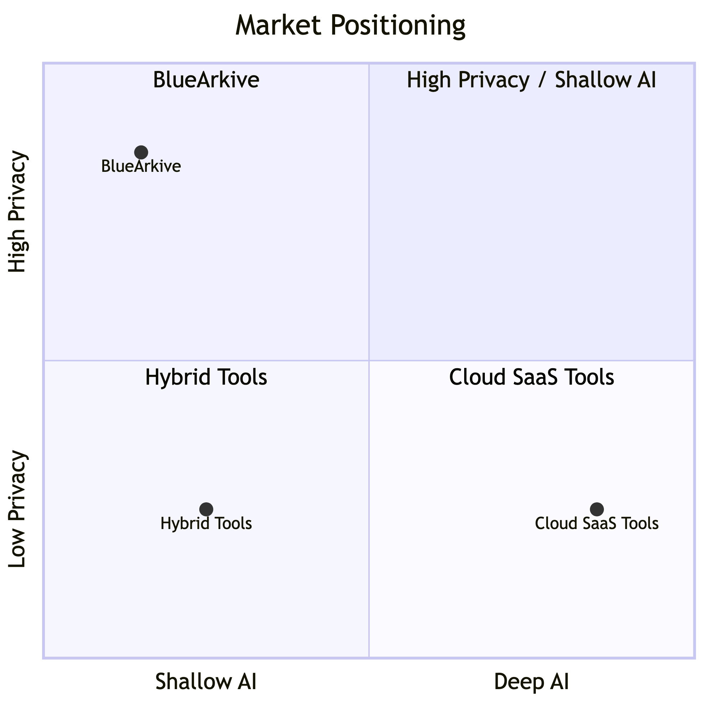
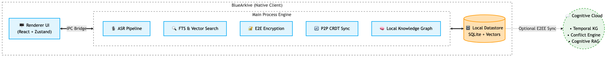

# BlueArkive — Product Brief

> **Product Name**: BlueArkive  
> **Tagline**: Your meetings remember everything. You don't have to.  
> **Version**: 0.3.6 (Private Beta)  
> **Platform**: macOS (primary) · Windows · Linux  
> **Category**: AI Meeting Intelligence · Local-First Productivity · Cognitive Memory Fabric  
> **Website**: [bluearkive.com](https://bluearkive.com)  
> **Brief Owner**: Piyush Kumar — Founder & CEO  
> **Date**: May 30, 2026  
> **Status**: 🟡 Private Beta → Public Beta (Q3 2026)

---

## 1. Problem Statement

### What problem are we solving?

**Professionals lose 80% of meeting value within 24 hours.** The average knowledge worker attends 15.5 meetings per week (Microsoft Work Trend Index 2025), yet retains less than 20% of what was discussed by the next day (Ebbinghaus forgetting curve). This creates a compounding organizational amnesia:

- **Action items vanish.** 63% of action items from meetings are never completed because they weren't captured or were lost in scattered notes.
- **Decisions are forgotten.** Teams re-discuss the same topics across multiple meetings, wasting an estimated 31 hours/month per employee.
- **Context collapses.** When a team member asks "what did we decide about X three weeks ago?", no one can answer with certainty. The institutional memory lives in someone's head — or nowhere.

### Why existing solutions fail

| Pain Point       | Current State                                            | Why It Fails                                                                                             |
| ---------------- | -------------------------------------------------------- | -------------------------------------------------------------------------------------------------------- |
| **Privacy**      | Existing tools send all audio to cloud servers           | Regulated industries (healthcare, legal, finance) cannot use them. HIPAA/SOC2 violations.                |
| **Intelligence** | Most tools are transcript dumps — keyword search at best | No understanding of _relationships_ between meetings. No contradiction detection. No temporal reasoning. |
| **Ownership**    | Data lives on vendor servers                             | Vendor lock-in. If a provider shuts down or raises prices, your entire meeting history is hostage.       |
| **Integration**  | Standalone tools that don't connect to workflow          | Transcripts sit in a silo. No knowledge graph. No cross-meeting action item tracking.                    |
| **Cost**         | $20-40/user/month for basic transcription                | Unsustainable for teams of 10+. Most of the cost pays for cloud compute, not intelligence.               |

### The deeper insight

The real problem isn't transcription — it's **cognitive decay**. Meetings generate the richest, most context-dense knowledge in an organization, yet it's the _least structured and least retrievable_. Email has search. Code has Git. Documents have version history. But meetings? They evaporate.

**BlueArkive treats meetings as first-class knowledge objects** — transcribed, encrypted, semantically indexed, connected through a knowledge graph, and queryable with natural language — all without your data ever leaving your device.

---

## 2. Product Vision

> **We are building the world's first sovereign cognitive memory fabric for meetings.**

BlueArkive is not a transcription tool. It's a **local-first intelligence layer** that transforms ephemeral conversations into persistent, queryable, interconnected organizational memory — with the privacy guarantees that regulated industries demand and the cognitive depth that cloud-first architectures fundamentally cannot deliver.

### Vision Statement (3-Year)

By 2029, BlueArkive will be the default meeting intelligence platform for privacy-conscious organizations — from solo consultants to Fortune 500 legal departments — replacing the fragile cloud-dependent tools of the 2020s with a sovereign, AI-native knowledge fabric that users actually own.

### Core Design Principles

| Principle                   | What It Means                                                              | How We Enforce It                                                                                                                              |
| --------------------------- | -------------------------------------------------------------------------- | ---------------------------------------------------------------------------------------------------------------------------------------------- |
| **Local-First**             | Core functionality works without internet. Your data lives on your device. | All AI inference, transcription, search, and encryption run via edge-optimized machine learning and embedded local storage.                    |
| **Privacy by Architecture** | Privacy isn't a feature toggle — it's a structural guarantee.              | Military-grade AES-256-GCM encryption with rigorous key derivation. Keys stored securely in the native OS keychain. Zero-knowledge cloud sync. |
| **Cognitive Depth**         | Go beyond transcription to understanding.                                  | Knowledge graph with entity extraction, contradiction detection, sentiment analysis, and temporal reasoning.                                   |
| **Data Sovereignty**        | Users own their data. Period.                                              | 24-word BIP39 recovery phrase. Crypto-shredding capability. Self-hostable backend. No vendor lock-in.                                          |
| **Hardware-Adaptive**       | Performance should match the device.                                       | 3-tier hardware detection (high/mid/low) with Apple Silicon GPU acceleration and battery-aware scheduling.                                     |

---

## 3. Product Objectives

### Primary Objectives (v1.0 — Public Launch)

| #   | Objective                                           | Key Result                                                                      | Target Date |
| --- | --------------------------------------------------- | ------------------------------------------------------------------------------- | ----------- |
| O1  | **Ship production-grade local transcription**       | < 3s latency on Apple Silicon, 95%+ WER accuracy via Whisper                    | Q3 2026     |
| O2  | **Deliver "Ask Your Meetings" intelligence**        | Users can query across all meetings with natural language and get cited answers | Q3 2026     |
| O3  | **Achieve enterprise-grade security certification** | Pass SOC2 Type I audit; HIPAA-compliant architecture validated                  | Q4 2026     |
| O4  | **Establish product-market fit signal**             | 500 active beta users, 40%+ weekly retention, NPS > 50                          | Q4 2026     |
| O5  | **Launch pricing and billing**                      | Functional 5-tier billing (Free → Enterprise) with Razorpay + LemonSqueezy      | Q3 2026     |

### Stretch Objectives (v1.5+)

| #   | Objective                         | Key Result                                                           | Target Date |
| --- | --------------------------------- | -------------------------------------------------------------------- | ----------- |
| S1  | **Team collaboration**            | Shared workspaces with role-based access, centralized billing        | Q1 2027     |
| S2  | **Mobile companion app**          | iOS/Android app for meeting playback and search (read-only MVP)      | Q2 2027     |
| S3  | **Calendar-aware auto-recording** | Auto-start transcription when a calendar meeting begins              | Q1 2027     |
| S4  | **Webhook ecosystem**             | Event-driven integrations (Slack, Notion, Linear, Jira) via webhooks | Q1 2027     |

---

## 4. Target Audience

### Primary Personas

#### Persona 1: "The Solo Consultant" — Maya, 34

| Attribute          | Detail                                                                                                                                                                                     |
| ------------------ | ------------------------------------------------------------------------------------------------------------------------------------------------------------------------------------------ |
| **Role**           | Independent management consultant                                                                                                                                                          |
| **Pain**           | Takes 8-12 client meetings/week. Spends 2+ hours/day writing up notes. Can't search across past client conversations.                                                                      |
| **Current Tools**  | Apple Notes + Voice Memos + manual transcription                                                                                                                                           |
| **Why BlueArkive** | Automatic transcription saves 10+ hrs/week. Cross-meeting search means she can recall what Client X said about budget 3 months ago in seconds. Client confidentiality demands local-first. |
| **Tier**           | Pro ($19/mo)                                                                                                                                                                               |
| **Deal Breaker**   | If any client audio touches a third-party server                                                                                                                                           |

#### Persona 2: "The Engineering Lead" — Raj, 29

| Attribute          | Detail                                                                                                                                                                  |
| ------------------ | ----------------------------------------------------------------------------------------------------------------------------------------------------------------------- |
| **Role**           | Senior Engineering Manager at a 200-person startup                                                                                                                      |
| **Pain**           | 15+ meetings/week. Decisions made in standups get lost. Action items from sprint retros are never tracked. New hires have zero context on past architectural decisions. |
| **Current Tools**  | Google Meet recordings (which nobody re-watches) + Notion (manually updated)                                                                                            |
| **Why BlueArkive** | Knowledge graph connects decisions across sprints. "Ask Meetings" gives new hires instant context. Weekly digest auto-summarizes what happened.                         |
| **Tier**           | Team ($15/user/mo)                                                                                                                                                      |
| **Deal Breaker**   | If it requires admin overhead to set up or manage                                                                                                                       |

#### Persona 3: "The Compliance Officer" — Dr. Sarah, 42

| Attribute          | Detail                                                                                                                                                                                  |
| ------------------ | --------------------------------------------------------------------------------------------------------------------------------------------------------------------------------------- |
| **Role**           | Chief Compliance Officer at a regional hospital network                                                                                                                                 |
| **Pain**           | Clinical team meetings discuss PHI. Federal regulations prohibit sending audio to cloud services. Current meeting tools are banned by IT.                                               |
| **Current Tools**  | Manual note-taking + locked filing cabinets                                                                                                                                             |
| **Why BlueArkive** | HIPAA-compliant architecture (local processing + encryption + audit logs). PHI auto-detection prevents accidental data leakage through comprehensive scanning of sensitive identifiers. |
| **Tier**           | Enterprise (Custom)                                                                                                                                                                     |
| **Deal Breaker**   | If it can't pass their security audit                                                                                                                                                   |

### Market Segmentation

| Segment                                                       | TAM Estimate               | Priority               | Why                                                                      |
| ------------------------------------------------------------- | -------------------------- | ---------------------- | ------------------------------------------------------------------------ |
| **Solo Knowledge Workers** (consultants, lawyers, therapists) | ~12M users globally        | 🔴 P0 — Launch segment | Low acquisition cost, high pain, privacy-sensitive, word-of-mouth driven |
| **Startup Engineering Teams** (5-50 person)                   | ~800K teams globally       | 🟠 P1 — Post-launch    | Team features drive expansion revenue, strong PLG motion                 |
| **Regulated Enterprise** (healthcare, legal, finance)         | ~2M organizations globally | 🟡 P2 — v1.5+          | Highest ARPU, longest sales cycle, requires compliance certifications    |

---

## 5. Key Features & Functionality

### 5.1 Core Features (v1.0 — Must Ship)

#### 🎙️ Real-Time Local Transcription

- **What**: Live speech-to-text using state-of-the-art transcription models running entirely locally, with simultaneous mic and system audio capture.
- **Why it matters**: Captures both sides of the conversation (you and the remote participants on Zoom/Teams) securely without virtual audio cables. < 3s latency on Apple Silicon.
- **Technical**: Native multi-channel capture for system and microphone audio. Advanced voice activity detection and intelligent chunking ensure high accuracy and performance. Hardware-adaptive model selection.

#### 👥 Local Speaker Diarization

- **What**: Identifies 'Speaker A' vs 'Speaker B' entirely on-device.
- **Why it matters**: A transcript is useless if you don't know who agreed to the deal. Local diarization maintains privacy while structuring the conversation.
- **Technical**: Integrated into the transcription pipeline, avoiding expensive and privacy-violating cloud API calls.

#### 🔐 End-to-End Encryption

- **What**: AES-256-GCM encryption with rigorous key derivation
- **Why it matters**: Even if a device is stolen, data is unreadable without the user's passphrase
- **Technical**: Keys stored securely in the native OS keychain. Standard 24-word recovery phrase. Cryptographic keys are aggressively zeroed from memory on lock or shutdown. Crypto-shredding guarantees all data is permanently unrecoverable upon key deletion.

#### 🔍 Semantic Search & Chat ("Ask Your Meetings")

- **What**: A "ChatGPT-like" conversational interface with real-time token streaming, capable of natural language queries across all historical transcripts and notes.
- **Why it matters**: Keyword search fails when you forget exact phrasing. "What did we decide about the pricing model?" returns the exact moment with synthesized answers and interactive source citations.
- **Technical**: Utilizes an advanced **Cognitive RAG Pipeline** with a **3-tier search escalation** architecture: (1) Instant local full-text search, (2) Local semantic search via embedded models, and (3) Cloud-hybrid semantic and fuzzy search (tier-gated). Results are rank-fused across tiers. Conversational state is managed natively with streaming token support and mid-generation cancellation, freeing hardware resources immediately. Crash-safe local indexing ensures query availability immediately post-meeting.

#### 🧠 Bitemporal Knowledge Graph

- **What**: Automatically extracts entities (people, topics, decisions, action items) and maps multi-hop relationships across your entire meeting history.
- **Why it matters**: Transcripts are static; a knowledge graph is a living memory. It surfaces connections humans miss — e.g., "Every time we discuss pricing, Sarah raises compliance concerns."
- **Technical**: Advanced entity extraction via local machine learning models. Powered by an internal **Conflict Resolution Engine**, utilizing intelligent logic to detect temporal contradictions (e.g., a decision made in Q1 reversed in Q2). Visualized locally via an interactive force-directed graph.

#### 📝 AI-Powered Note Expansion & Derivation

- **What**: A rich text editor (TipTap) that acts as an autonomous scribe. It uses the raw, multi-speaker transcript to auto-expand shorthand notes, summarize themes, and extract assignee-mapped action items.
- **Why it matters**: Turns messy, shorthand meeting notes into structured, shareable PRDs or executive summaries in one click, eliminating post-meeting administrative work.
- **Technical**: Context-aware AI processing grounded in intelligently chunked transcripts. Derives underlying intent rather than just summarizing text. Includes deterministic action item extraction.

#### 💡 Live AI Coach & Silent Prompter

- **What**: Real-time, in-meeting suggestions that push directly to the OS overlay based on meeting context, supporting **4 prompt modes**: title suggestion, follow-up question, action item extraction, and decision summarization.
- **Why it matters**: Guides negotiations, reminds you to ask qualifying questions, or notes when you are dominating the conversation without distracting you. Each mode produces a structurally different output — not just generic summaries.
- **Technical**: Contextually generates suggestions from recent transcript history. **Dual-path execution**: Premium cloud execution for advanced modes, with a local on-device fallback always available. Model parameters adapt dynamically per mode to optimize for analytical precision or creative questioning. Seamlessly updates the OS widget state.

#### 📅 Automated Weekly Digest

- **What**: A synthesized, cross-meeting report generated at the end of the week, summarizing key decisions, persistent blockers, and macro-trends across all conversations.
- **Why it matters**: Gives executives and managers a "bird's-eye view" of their week without re-reading transcripts. Highlights unresolved action items automatically.
- **Technical**: Aggregates local meeting statistics and fuses them with AI-derived macro-insights. Works gracefully offline by prioritizing local heuristics, falling back to cloud enrichment only if permitted by tier.

#### 🏝️ Persistent OS Capture (Dynamic Island) & Global Shortcuts

- **What**: A floating, always-on top OS-level widget (Dynamic Island style) that provides spatial handoff and **full meeting control without restoring the main window** — including quick notes, bookmarks, pause/resume, and start capture — paired with global keyboard shortcuts.
- **Why it matters**: You shouldn't have to hunt for a window to start recording or view a coach tip. The widget is a complete control surface: submit a quick note, drop a bookmark on an important moment, or pause recording — all without switching apps.
- **Technical**: Native-feeling OS overlay with robust window detection. Secure proxy channels for quick actions with smooth spatial handoff animations. Visibility is auto-managed based on recording state, paired with system-wide hotkeys.

#### 🎓 Interactive Ghost Meeting Tutorial

- **What**: A state-machine-driven onboarding experience that simulates a real meeting — live transcript streaming, AI Coach suggestions, note expansion, and Dynamic Island takeover — before the user's first real session.
- **Why it matters**: Most productivity tools overwhelm new users with feature lists. BlueArkive _shows_ the product in action through a 5-step interactive tutorial, building muscle memory before the first real meeting. Users experience the "aha moment" in 90 seconds, not 90 minutes.
- **Technical**: 5-phase state machine driving an interactive tutorial. Uses real UI components — not mockups — for live transcript streaming, AI Coach demonstrations, and note expansion. Features typewriter animations for AI responses and a progress indicator, with the ability to skip anytime.

#### 🩺 Self-Healing Health Dashboard

- **What**: A 7-system diagnostic panel that tests all critical subsystems (Database, Auth, Microphone, Screen Recording, Network, Disk Space, Native Modules) and offers one-click proactive repair actions.
- **Why it matters**: Enterprise users and IT admins need to verify system health without contacting support. The dashboard turns "it's not working" support tickets into self-service fixes.
- **Technical**: Runs 7 diagnostic probes in sequence covering database connectivity, authentication, native OS media access, network health, disk space, and core modules. Provides direct repair actions such as requesting OS permissions, deep-linking to system settings, or self-service search index rebuilding.

#### 📱 Device Management

- **What**: Multi-device registration, tier-gated device limits, remote deactivation, and device renaming — with structured error responses when limits are exceeded.
- **Why it matters**: Users need to manage which devices have access to their meeting data. Tier-gated device limits drive upgrades (Free: 1 device, Starter: 2, Pro+: unlimited).
- **Technical**: Centralized device management service supporting registration and limits based on subscription tier. Limit-exceeded scenarios are handled gracefully to present contextual upgrade paths.

#### 🔋 Battery-Aware Resource Scheduling

- **What**: Automatic detection of battery vs. AC power state, with resource reduction when on battery to preserve laptop battery during long meetings.
- **Why it matters**: A 2-hour meeting on battery shouldn't kill your laptop. BlueArkive automatically reduces AI inference frequency, defers background embedding, and throttles sync when unplugged.
- **Technical**: Wraps native OS power monitoring APIs. Battery state is propagated throughout the application, automatically instructing resource-intensive subsystems to scale down when unplugged.

#### 🔄 Encrypted Cloud Sync

- **What**: Multi-device sync with end-to-end encryption. Data is encrypted before it leaves the device.
- **Why it matters**: Use BlueArkive on your MacBook at work and your iMac at home without compromising privacy
- **Technical**: Vector clock-based conflict resolution and CRDT compatibility ensure robust multi-device sync. Data is synced atomically with strict schema whitelisting.

### 5.2 Differentiating Features

| Feature                           | Capability                                      | Industry Standard                       |
| --------------------------------- | ----------------------------------------------- | --------------------------------------- |
| **Local-first processing**        | ✅ All AI runs locally on-device                | Most tools require cloud processing     |
| **System Audio Capture**          | ✅ WASAPI / ScreenCaptureKit native             | Often requires clunky 3rd party drivers |
| **Local Speaker Diarization**     | ✅ Identifies speakers on-device                | Almost exclusively cloud-based          |
| **End-to-end encryption**         | ✅ AES-256-GCM + BIP39 recovery                 | Rare in meeting tools                   |
| **Cross-meeting knowledge graph** | ✅ Entity + relationship mapping                | Not available elsewhere                 |
| **Contradiction detection**       | ✅ Temporal reasoning across meetings           | Not available elsewhere                 |
| **PHI auto-detection**            | ✅ 17 identifiers + Luhn validation             | Not available elsewhere                 |
| **Live AI Coach**                 | ✅ Real-time contextual nudges                  | Not available elsewhere                 |
| **Dynamic Island & Hotkeys**      | ✅ Persistent spatial handoff UI                | Not available elsewhere                 |
| **Hardware-adaptive AI**          | ✅ 3-tier + GPU + battery-aware                 | Not available elsewhere                 |
| **Self-hostable backend**         | ✅ IBackendProvider abstraction                 | Rare in meeting tools                   |
| **Crypto-shredding**              | ✅ Delete keys = delete all data                | Not available elsewhere                 |
| **Weekly meeting digest**         | ✅ Auto-generated summaries                     | Limited availability                    |
| **Offline functionality**         | ✅ Full (transcription + search + notes)        | Rare — most require internet            |
| **Sentiment analysis**            | ✅ Per-segment emotional tone                   | Limited availability                    |
| **Audit logs (HIPAA)**            | ✅ Tamper-evident logging + CSV export          | Not available elsewhere                 |
| **Ghost Meeting onboarding**      | ✅ Interactive tutorial with real UI components | Not available elsewhere                 |
| **Self-healing diagnostics**      | ✅ 7-system health check + 1-click repair       | Not available elsewhere                 |
| **Multi-mode AI suggestions**     | ✅ 4 modes (title/question/action/decision)     | Not available elsewhere                 |
| **Cancellable AI generation**     | ✅ AbortController mid-stream cancellation      | Not available elsewhere                 |
| **Widget quick actions**          | ✅ Notes/bookmarks/pause from widget            | Not available elsewhere                 |
| **Battery-aware scheduling**      | ✅ Auto-reduces resources on battery            | Rare in meeting tools                   |
| **3-tier search escalation**      | ✅ FTS5 → Semantic → Cloud Hybrid               | Not available elsewhere                 |
| **Device management**             | ✅ Multi-device registration + tier limits      | Limited availability                    |

### 5.3 Feature Tiers (Pricing Gates)

| Feature                | Free      | Starter ($9/mo) | Pro ($19/mo) | Team ($15/user/mo) | Enterprise  |
| ---------------------- | --------- | --------------- | ------------ | ------------------ | ----------- |
| Local transcription    | ✅        | ✅              | ✅           | ✅                 | ✅          |
| Transcript limit       | 5K chars  | 15K chars       | 50K chars    | 100K chars         | 100K chars  |
| Cloud sync             | —         | ✅              | ✅           | ✅                 | ✅          |
| Devices                | 1         | 2               | Unlimited    | Unlimited          | Unlimited   |
| AI queries/mo          | —         | 50              | Unlimited    | Unlimited          | Unlimited   |
| Knowledge Graph        | View only | View only       | Interactive  | Interactive        | Interactive |
| Speaker diarization    | —         | ✅              | ✅           | ✅                 | ✅          |
| Weekly digest          | —         | ✅              | ✅           | ✅                 | ✅          |
| Hybrid search          | —         | —               | ✅           | ✅                 | ✅          |
| Calendar sync          | —         | ✅              | ✅           | ✅                 | ✅          |
| Calendar auto-link     | —         | —               | ✅           | ✅                 | ✅          |
| Webhooks               | —         | 3               | 10           | Unlimited          | Unlimited   |
| Team collaboration     | —         | —               | —            | ✅                 | ✅          |
| Audit logs             | —         | —               | —            | —                  | ✅          |
| SSO / SAML             | —         | —               | —            | —                  | ✅          |
| Custom SLA             | —         | —               | —            | —                  | ✅          |
| Sentiment analysis     | ✅        | ✅              | ✅           | ✅                 | ✅          |
| Action items           | ✅        | ✅              | ✅           | ✅                 | ✅          |
| Dynamic Island Widget  | ✅        | ✅              | ✅           | ✅                 | ✅          |
| Widget quick actions   | ✅        | ✅              | ✅           | ✅                 | ✅          |
| Health Dashboard       | ✅        | ✅              | ✅           | ✅                 | ✅          |
| Ghost Meeting tutorial | ✅        | ✅              | ✅           | ✅                 | ✅          |
| Device management      | 1 device  | 2 devices       | Unlimited    | Unlimited          | Unlimited   |
| Live AI Coach          | —         | —               | ✅           | ✅                 | ✅          |
| Multi-mode suggestions | —         | Title only      | All 4 modes  | All 4 modes        | All 4 modes |

---

## 6. Strategic Advantages

### Why BlueArkive Wins

1. **Privacy is structural, not promised.** BlueArkive _architecturally cannot_ access your data — keys live in your OS keychain, not on our servers. This is a design guarantee, not a policy promise.

2. **Intelligence compounds over time.** A transcript is a snapshot. A knowledge graph is a living memory. BlueArkive gets smarter with every meeting — after 50 meetings, the intelligence gap is uncatchable.

3. **Regulated industries have no alternative.** A HIPAA-compliant meeting intelligence tool that works offline with E2E encryption and PHI detection doesn't exist today. We are creating the category.

4. **Cloud economics favor us.** Cloud-based transcription costs ~$0.006/minute per user. Our marginal cost per user is near zero — inference runs on the user's own hardware. This enables a structurally lower price point with higher margins.

### Latency: BlueArkive vs Cluely

| Operation           | BlueArkive (Local)                  | Cluely (Cloud)                                    | Winner        |
| ------------------- | ----------------------------------- | ------------------------------------------------- | ------------- |
| **STT Processing**  | 0.58s per 30s audio (Whisper Turbo) | Network RTT + Deepgram API queue                  | 🏆 BlueArkive |
| **STT (low-tier)**  | 34ms per 10s audio (Moonshine)      | Same cloud dependency                             | 🏆 BlueArkive |
| **LLM First Token** | ~130ms (Qwen 2.5 3B local)          | 5–90 seconds (reported by users/Business Insider) | 🏆 BlueArkive |
| **Search (FTS5)**   | <1ms average across 100K segments   | Pinecone API call + network                       | 🏆 BlueArkive |
| **Database Writes** | 75,188 inserts/sec (SQLite WAL)     | Neon serverless cold-start + network              | 🏆 BlueArkive |
| **Offline Latency** | Same as above — zero degradation    | ∞ — completely non-functional                     | 🏆 BlueArkive |
| **VAD Processing**  | <10ms per chunk (Silero ONNX)       | Unknown (likely server-side)                      | 🏆 BlueArkive |

#### Why the gap is so massive

- **BlueArkive's latency** = compute time only — no network hop, no API queue, no cold start.
- **Cluely's latency** = network RTT + API queue + vendor processing + return trip — for every single request, through multiple vendors in series (Deepgram → Pinecone → OpenAI → Pusher).

The 5–90 second latency range reported for Cluely makes it essentially useless for real-time interview/meeting assistance — the very thing it's marketed for. BlueArkive's 130ms time-to-first-token is **~40-700× faster**.

**BlueArkive wins latency by 1-3 orders of magnitude. 🏆**

### Market Positioning

BlueArkive occupies the **top-left quadrant** — deep AI with high privacy — a position that is structurally difficult for cloud-first incumbents to reach because privacy requires architectural commitment, not feature additions.

---

## 7. Technical Architecture

### System Overview

### Technology Stack

| Layer             | Technology                               | Why                                                                |
| ----------------- | ---------------------------------------- | ------------------------------------------------------------------ |
| **Runtime**       | Modern secure native wrapper             | Cross-platform native app with system-level audio access           |
| **Frontend**      | Performant Web Technologies              | Smooth state management, declarative UI                            |
| **Database**      | Crash-safe embedded database             | < 1ms reads, fully local, enterprise-ready datastore               |
| **Search**        | Embedded Search (FTS + Vector)           | Hybrid keyword + semantic search without cloud dependency          |
| **ASR**           | State-of-the-art ASR                     | High accuracy, runs locally with hardware acceleration             |
| **Encryption**    | AES-256-GCM + PBKDF2                     | Military-grade encryption with OS-native key storage               |
| **Visualization** | Native interactive data mapping          | Interactive knowledge graph with dynamic capability                |
| **Sync**          | Vector clocks + CRDT                     | Conflict-free multi-device sync without central authority          |
| **Cloud Backend** | Cognitive Cloud Backend                  | Advanced cognitive engine with bitemporal KG and tool integrations |
| **Billing**       | Razorpay (India) + LemonSqueezy (Global) | Dual payment gateway for global + India-specific pricing (INR)     |

### Service Architecture (40 Services)

| Category         | Services                                                                                      | Purpose                                                   |
| ---------------- | --------------------------------------------------------------------------------------------- | --------------------------------------------------------- |
| **Audio**        | ASRService, AudioPipelineService, AudioCacheCleanup                                           | Capture → VAD → Whisper → Transcript                      |
| **Intelligence** | LocalEntityExtractor, SentimentAnalyzer, ActionItemService                                    | Entity extraction, sentiment, action items                |
| **Storage**      | DatabaseService, MigrationService, BackgroundEmbeddingQueue                                   | SQLite ops, schema migrations, async embedding            |
| **Search**       | LocalEmbeddingService (FTS5 + vectors)                                                        | Hybrid semantic + keyword search                          |
| **Security**     | EncryptionService, KeyStorageService, RecoveryPhraseService, PHIDetectionService, AuditLogger | E2E encryption, key management, PHI scanning, audit trail |
| **Sync**         | SyncManager, ConflictResolver, VectorClockManager, YjsConflictResolver, DeviceManager         | Multi-device sync with CRDT conflict resolution           |
| **Cloud**        | AuthService, CloudAccessManager, CloudTranscriptionService                                    | Authentication, tier gating, cloud AI fallback            |
| **Backend**      | Multi-Backend Provider Abstraction                                                            | Provider registry pattern for seamless backend swapping   |
| **Platform**     | Hardware & Model Lifecycle Services                                                           | Hardware detection, pricing tiers, model lifecycle        |
| **Ops**          | Observability & Diagnostic Services                                                           | Observability, crash reporting, rate limiting, webhooks   |
| **DI**           | Dependency Injection Container                                                                | Lazy singleton dependency injection for core services     |

### Security Architecture (13 Controls)

| #   | Control                    | Implementation                                                            |
| --- | -------------------------- | ------------------------------------------------------------------------- |
| 1   | **AES-256-GCM Encryption** | All data encrypted at rest with rigorously derived keys                   |
| 2   | **OS Keychain Storage**    | Keys stored natively — never on disk or in source code                    |
| 3   | **BIP39 Recovery**         | 24-word mnemonic for user-controlled key recovery                         |
| 4   | **Crypto-Shredding**       | Delete keys → all synced data permanently unrecoverable                   |
| 5   | **Key Zeroing**            | Cryptographic keys aggressively wiped from memory on lock/logout/shutdown |
| 6   | **Context Isolation**      | Strict sandboxing and disabled node integration                           |
| 7   | **CSP Header**             | Content-Security-Policy blocks unauthorized code execution                |
| 8   | **Navigation Guard**       | Navigation handlers prevent renderer hijacking                            |
| 9   | **Injection Prevention**   | Strict schema whitelisting for all data synchronization operations        |
| 10  | **Index Crash Safety**     | Per-table error isolation ensures no search outage                        |
| 11  | **PHI Detection**          | Comprehensive detection of sensitive identifiers                          |
| 12  | **Audit Logging**          | Tamper-evident logs for HIPAA compliance                                  |
| 13  | **Web Security**           | Strict web security enforced on all application windows                   |

---

## 8. User Stories

### Epic 1: Meeting Capture

| ID     | As a...                    | I want to...                                  | So that...                                             | Priority | Status  |
| ------ | -------------------------- | --------------------------------------------- | ------------------------------------------------------ | -------- | ------- |
| US-101 | Knowledge worker           | Start recording a meeting with one click      | I don't have to manually take notes                    | P0       | ✅ Done |
| US-102 | Consultant                 | See live transcription as people speak        | I can follow along and correct errors in real-time     | P0       | ✅ Done |
| US-103 | Privacy-conscious user     | Have all transcription happen on my device    | No audio ever leaves my machine                        | P0       | ✅ Done |
| US-104 | User with limited hardware | Have the app adapt AI quality to my hardware  | It doesn't crash or drain my battery on older machines | P1       | ✅ Done |
| US-105 | Mobile professional        | Record meetings offline (airplane, poor WiFi) | I never miss capturing a conversation                  | P0       | ✅ Done |

### Epic 2: Intelligence & Search

| ID     | As a...            | I want to...                                                  | So that...                                                           | Priority | Status  |
| ------ | ------------------ | ------------------------------------------------------------- | -------------------------------------------------------------------- | -------- | ------- |
| US-201 | Engineering lead   | Ask "What did we decide about the database migration?"        | I get the exact answer with the meeting source cited                 | P0       | ✅ Done |
| US-202 | Consultant         | See all meetings where "Client X" was discussed               | I can prepare for a follow-up meeting in 2 minutes                   | P0       | ✅ Done |
| US-203 | Product manager    | View a knowledge graph of how topics connect                  | I can see patterns across a quarter of meetings                      | P1       | ✅ Done |
| US-204 | Team lead          | Get a weekly digest of all meetings                           | I can catch up on what my team discussed without watching recordings | P1       | ✅ Done |
| US-205 | Compliance officer | Detect when a meeting conclusion contradicts a prior decision | I can flag inconsistencies before they become problems               | P2       | 🟡 Beta |

### Epic 3: Security & Privacy

| ID     | As a...                 | I want to...                                     | So that...                                                 | Priority | Status  |
| ------ | ----------------------- | ------------------------------------------------ | ---------------------------------------------------------- | -------- | ------- |
| US-301 | Healthcare professional | Have PHI automatically detected before any sync  | Patient information never leaves my device                 | P0       | ✅ Done |
| US-302 | Enterprise admin        | View tamper-evident audit logs                   | I can prove compliance during SOC2 audits                  | P1       | ✅ Done |
| US-303 | Departing employee      | Crypto-shred all my data with one action         | My meeting data is permanently unrecoverable after I leave | P0       | ✅ Done |
| US-304 | Multi-device user       | Sync meetings across devices with E2E encryption | I can access meetings on my work laptop and home desktop   | P0       | ✅ Done |

### Epic 4: Team Collaboration

| ID     | As a...    | I want to...                                            | So that...                                                      | Priority | Status     |
| ------ | ---------- | ------------------------------------------------------- | --------------------------------------------------------------- | -------- | ---------- |
| US-401 | Team admin | Create a shared workspace for my team                   | We can pool meeting intelligence across the team                | P2       | 🔜 Planned |
| US-402 | Manager    | Get webhook notifications when action items are created | They flow into our project tracker (Linear, Jira) automatically | P2       | 🟡 Beta    |
| US-403 | New hire   | Search all team meeting history for onboarding context  | I can ramp up in days instead of weeks                          | P2       | 🔜 Planned |

### Epic 5: Onboarding & Self-Service

| ID     | As a...                 | I want to...                                                           | So that...                                                          | Priority | Status  |
| ------ | ----------------------- | ---------------------------------------------------------------------- | ------------------------------------------------------------------- | -------- | ------- |
| US-501 | First-time user         | Experience a simulated meeting tutorial before my first real recording | I understand the product's value in 90 seconds without reading docs | P0       | ✅ Done |
| US-502 | Non-technical user      | See a health dashboard showing if mic/network/database are working     | I can self-diagnose issues without contacting support               | P1       | ✅ Done |
| US-503 | User with broken search | Rebuild my search indexes from the health dashboard                    | I can fix corrupted FTS5 indexes without reinstalling the app       | P1       | ✅ Done |
| US-504 | Multi-device user       | See which devices are registered and deactivate old ones               | I can manage my device limit and free slots for new machines        | P1       | ✅ Done |
| US-505 | Laptop user on battery  | Have the app automatically reduce resource usage on battery            | My laptop battery isn't drained during a long meeting               | P1       | ✅ Done |

---

## 9. Real-Life Examples & User Journeys

### Journey 1: The Solo Consultant's Context Recall
**Persona:** Maya (Independent Management Consultant)
**Scenario:** Maya is preparing for a check-in with a major client she hasn't spoken to in three months. She remembers they had a brief debate about budget constraints, but she forgot the specific details they agreed upon.

**The Journey:**
1. **The Trigger:** Maya has a meeting with "Acme Corp" in 10 minutes.
2. **The Action:** Instead of digging through three months of scattered Apple Notes and trying to listen to old voice memos, she opens BlueArkive and queries: "What was the final budget constraint we agreed on with Acme Corp in our Q1 strategy meeting?"
3. **The Magic:** BlueArkive instantly queries the bitemporal knowledge graph and transcript embeddings locally. It responds: "In the March 15th meeting, the client stated the Q2 budget is hard-capped at $45,000, specifically excluding media spend."
4. **The Outcome:** Maya enters the meeting fully briefed, confidently referencing the $45k cap, making the client feel heard and valued.

### Journey 2: The Engineering Lead's Lost Decision
**Persona:** Raj (Senior Engineering Manager)
**Scenario:** Raj's backend team is arguing over whether they decided to use Redis or Memcached for the new caching layer during a chaotic sprint planning session two weeks ago. Half the team remembers Redis, the other half remembers Memcached.

**The Journey:**
1. **The Trigger:** A debate breaks out in Slack over the caching implementation.
2. **The Action:** Raj opens BlueArkive and queries: "Did we decide on Redis or Memcached for the caching layer, and why?"
3. **The Magic:** BlueArkive's contradiction detection and semantic search parse the sprint planning meeting. It points directly to the 14:22 timestamp and synthesizes: "The team initially leaned toward Memcached, but at 14:22, Alex pointed out the need for data persistence. You decided to go with Redis to support future pub/sub requirements."
4. **The Outcome:** The debate is instantly settled with undeniable proof. The team avoids hours of rework and context switching.

### Journey 3: The Compliance Officer's Secure Capture
**Persona:** Dr. Sarah (Chief Compliance Officer)
**Scenario:** A clinical review board is discussing sensitive patient cases. They need comprehensive minutes, but cloud-based AI tools are strictly forbidden due to HIPAA regulations.

**The Journey:**
1. **The Trigger:** The weekly clinical review meeting begins.
2. **The Action:** Dr. Sarah starts BlueArkive on her Macbook. The app runs completely offline.
3. **The Magic:** As doctors discuss cases, BlueArkive transcribes everything locally. Crucially, the PHI auto-detection system actively scans the transcript, redacting patient names and social security numbers from the generated summaries and knowledge graph before any data is encrypted and saved.
4. **The Outcome:** The hospital gets highly accurate, searchable meeting minutes with zero risk of PHI leaving the local machine or violating HIPAA compliance.

---

## 10. Timeline & Milestones

### Phase 1: Foundation (Completed — Q4 2025 – Q2 2026)

| Milestone                 | Status      | Deliverables                                                                 |
| ------------------------- | ----------- | ---------------------------------------------------------------------------- |
| Core transcription engine | ✅ Complete | State-of-the-art speech models, voice activity pipeline, real-time streaming |
| Encryption infrastructure | ✅ Complete | AES-256-GCM, native OS keychain integration, standard recovery               |
| Database layer            | ✅ Complete | Embedded datastore, local search indexing, vector embeddings                 |
| UI shell                  | ✅ Complete | Meeting list, detail view, notes editor, settings, onboarding                |
| Backend abstraction       | ✅ Complete | Robust multi-provider abstraction and strict factory patterns                |
| Security hardening        | ✅ Complete | Application sandboxing, comprehensive PHI detection, secure memory handling  |
| Knowledge graph MVP       | ✅ Complete | Entity extraction, interactive visualization, basic relationship mapping     |

### Phase 2: Intelligence & Polish (Current — Q3 2026)

| Milestone                | Target    | Deliverables                                                        |
| ------------------------ | --------- | ------------------------------------------------------------------- |
| Ask Meetings v1          | July 2026 | Semantic search with cited answers, context-aware responses         |
| Weekly Digest v1         | July 2026 | Auto-generated meeting summaries, trend detection                   |
| Speaker Diarization      | Aug 2026  | Multi-speaker identification and labeling                           |
| Pricing & Billing launch | Aug 2026  | Razorpay + LemonSqueezy integration, tier enforcement               |
| Public Beta launch       | Sep 2026  | Marketing site update, ProductHunt launch, beta waitlist conversion |

### Phase 3: Growth & Enterprise (Q4 2026 – Q1 2027)

| Milestone                 | Target   | Deliverables                                         |
| ------------------------- | -------- | ---------------------------------------------------- |
| SOC2 Type I certification | Nov 2026 | Security audit, compliance documentation             |
| Team workspaces v1        | Dec 2026 | Shared workspaces, admin controls, role-based access |
| Calendar integration      | Jan 2027 | Google Calendar + Outlook sync, auto-recording       |
| Webhook ecosystem v1      | Jan 2027 | Slack, Notion, Linear, Jira integrations             |
| Enterprise pilot program  | Feb 2027 | Custom SLA, SSO/SAML, dedicated support              |

### Phase 4: Scale (Q2 2027+)

| Milestone                | Target  | Deliverables                                      |
| ------------------------ | ------- | ------------------------------------------------- |
| Mobile companion app     | Q2 2027 | iOS/Android read-only app for search and playback |
| Windows/Linux stable     | Q2 2027 | Parity with macOS feature set                     |
| Self-hosted enterprise   | Q3 2027 | On-premises Cognitive Engine deployment package   |
| API & developer platform | Q3 2027 | Public API for custom integrations                |

---

## 11. Success Metrics

### North Star Metric

> **Weekly Active Meeting Hours Indexed (WAMHI)** — Total hours of meeting audio transcribed and indexed across all users per week.

_Why this metric:_ It captures both user acquisition (more users) and engagement depth (more meetings per user). A user who records one meeting is experimenting. A user who records 10 meetings/week has made BlueArkive essential.

### Leading Indicators

| Metric                        | Definition                                 | Target (Month 3) | Target (Month 6) | Target (Month 12) |
| ----------------------------- | ------------------------------------------ | ---------------- | ---------------- | ----------------- |
| **WAU (Weekly Active Users)** | Unique users who open the app              | 200              | 1,000            | 5,000             |
| **Meetings/User/Week**        | Avg meeting recordings per active user     | 2.5              | 4.0              | 6.0               |
| **Search Queries/User/Week**  | "Ask Meetings" queries per active user     | 1.0              | 3.0              | 5.0               |
| **D7 Retention**              | % of new users active 7 days after signup  | 35%              | 45%              | 55%               |
| **D30 Retention**             | % of new users active 30 days after signup | 15%              | 25%              | 35%               |
| **NPS**                       | Net Promoter Score (quarterly survey)      | 40               | 50               | 60+               |
| **Free → Paid Conversion**    | % of free users upgrading within 30 days   | 3%               | 5%               | 8%                |

### Revenue Metrics

| Metric                              | Target (Month 6) | Target (Month 12) |
| ----------------------------------- | ---------------- | ----------------- |
| **MRR (Monthly Recurring Revenue)** | $5,000           | $30,000           |
| **ARPU (Avg Revenue Per User)**     | $12              | $15               |
| **Churn Rate (Monthly)**            | < 8%             | < 5%              |
| **LTV:CAC Ratio**                   | > 2:1            | > 3:1             |

### Technical Health Metrics

| Metric                           | Target                                  |
| -------------------------------- | --------------------------------------- |
| **Transcription accuracy (WER)** | > 95% on native English audio           |
| **App crash rate**               | < 0.5% of sessions                      |
| **Search latency (p95)**         | < 500ms for hybrid semantic and keyword |
| **Cold start time**              | < 4s on modern silicon, < 8s on legacy  |
| **Database size efficiency**     | < 2MB per hour of meeting audio indexed |
| **Codebase stability**           | 0 errors across strict type-checking    |

---

## 12. Budget & Resources

### Infrastructure Costs (Monthly)

| Line Item                                        | Cost         | Notes                               |
| ------------------------------------------------ | ------------ | ----------------------------------- |
| Cloud Infrastructure (Database + Vector Storage) | $150/mo      | Enterprise-tier hosting             |
| Domain + DNS (bluearkive.com)                    | $15/mo       | Cloudflare                          |
| Vercel Hosting (landing page)                    | $0-20/mo     | Pro plan                            |
| Sentry (crash reporting)                         | $0/mo        | Free tier                           |
| Apple Developer Program                          | $8.25/mo     | $99/year for macOS signing          |
| Code signing (Windows)                           | ~$30/mo      | DigiCert EV certificate (amortized) |
| Total                                            | **~$225/mo** |                                     |

### Cost Advantages

| BlueArkive                                           | Cloud-Based Alternatives                         |
| ---------------------------------------------------- | ------------------------------------------------ |
| $0.00/user for transcription (runs on user hardware) | $0.006/min × 900 min/mo = $5.40/user/mo          |
| $0.00/user for embedding (local inference)           | $0.02/1K tokens × ~50K tokens/mo = $1.00/user/mo |
| $0.00/user for storage (local datastore)             | $0.023/GB × ~2GB/user = $0.05/user/mo            |
| **Marginal cost per user: ~$0**                      | **Marginal cost per user: ~$6.45/mo**            |

> At 10,000 users, cloud-based services spend ~$64,500/month on compute. BlueArkive spends ~$225/month total. This is a **structural cost advantage** that allows us to offer a better product at a lower price while maintaining higher margins.

### Funding Requirements

| Phase                          | Amount       | Use                                                              |
| ------------------------------ | ------------ | ---------------------------------------------------------------- |
| **Pre-Seed (Current)**         | Bootstrapped | Product development, initial users                               |
| **Seed (Target: Q4 2026)**     | $500K – $1M  | 2 engineers, go-to-market, SOC2 certification, first 1,000 users |
| **Series A (Target: Q3 2027)** | $3M – $5M    | Enterprise sales team, mobile apps, international expansion      |

---

## 13. Risks & Mitigations

| #   | Risk                                                                 | Likelihood | Impact   | Mitigation                                                                                                                                                                 |
| --- | -------------------------------------------------------------------- | ---------- | -------- | -------------------------------------------------------------------------------------------------------------------------------------------------------------------------- |
| R1  | **Whisper accuracy insufficient for accented English / non-English** | Medium     | High     | Support model swapping. Offer cloud transcription as premium fallback (already built: `CloudTranscriptionService`). Monitor WER by language.                               |
| R2  | **Apple blocks Electron apps or restricts audio capture**            | Low        | Critical | Build native macOS Swift UI fallback. Monitor Apple developer announcements. Maintain relationship with Apple developer relations.                                         |
| R3  | **Cloud incumbent adds local processing mode**                       | Medium     | High     | Cloud business models require server-side data. Our moat is the _knowledge graph_ + encryption, not just local processing.                                                 |
| R4  | **Enterprise sales cycle too long for bootstrapped startup**         | High       | Medium   | Focus on PLG (Product-Led Growth) with solo users first. Enterprise comes after product-market fit with individuals.                                                       |
| R5  | **Large model downloads deter first-time users**                     | Medium     | Medium   | Progressive download with `ModelDownloadService`. Start with distilled model (40MB). Full model downloads in background.                                                   |
| R6  | **SQLite performance degrades at scale (1000+ meetings)**            | Low        | Medium   | WAL mode + async embedding queue already handle this. If needed, migrate to local PostgreSQL via IBackendProvider abstraction.                                             |
| R7  | **Cloud incumbent copies our privacy positioning**                   | Medium     | Low      | Privacy requires _architectural_ commitment, not marketing. Retrofitting E2E encryption into a cloud-first product is a multi-year project. First-mover advantage is real. |
| R8  | **Regulation (GDPR/CCPA) creates compliance burden**                 | Low        | Medium   | Local-first architecture is _inherently_ compliant — we don't process or store user data. Crypto-shredding satisfies right-to-deletion.                                    |

---

#

## 14. Appendix

### A. Codebase Snapshot (May 2026)

| Metric                    | Value                         |
| ------------------------- | ----------------------------- |
| **Client Architecture**   | Modular, strictly typed       |
| **Backend Architecture**  | Proprietary Cognitive Engine  |
| **Backend testing**       | Extensive comprehensive suite |
| **Security Architecture** | Native sandboxing + isolation |
| **App version**           | 0.3.6                         |

### B. Key Dependencies

| Infrastructure Layer   | Purpose                                  |
| ---------------------- | ---------------------------------------- |
| **Embedded Database**  | High-performance local datastore         |
| **Inference Engine**   | Local AI execution and processing        |
| **Keychain Manager**   | OS keychain access for secure storage    |
| **Data Visualization** | Knowledge graph mapping and rendering    |
| **State Management**   | Performant application state             |
| **Editor Framework**   | Rich text notes and structured documents |
| **Telemetry**          | Crash reporting and diagnostics          |
| **Distribution**       | Seamless auto-updates                    |

### C. Cognitive Engine (Cloud Backend)

| Module                       | Function                                                |
| ---------------------------- | ------------------------------------------------------- |
| **Temporal Knowledge Graph** | Bitemporal Bayesian knowledge graph                     |
| **Conflict Engine**          | Intelligent conflict resolution (hallucination defense) |
| **Semantic Retrieval**       | Curiosity-driven semantic retrieval                     |
| **Adaptive Scorer**          | Multi-strategy adaptive scoring subsystem               |
| **Cognitive RAG**            | Advanced cognitive RAG pipeline                         |
| **Integration Hub**          | Extended tools for external AI agent synergy            |

### D. Pricing Reference Table

| Tier       | USD (Monthly) | USD (Yearly) | INR (Monthly)  | INR (Yearly) |
| ---------- | ------------- | ------------ | -------------- | ------------ |
| Free       | $0            | $0           | ₹0             | ₹0           |
| Starter    | $9/mo         | $7/mo        | ₹749/mo        | ₹599/mo      |
| Pro        | $19/mo        | $15/mo       | ₹1,499/mo      | ₹1,199/mo    |
| Team       | $15/user/mo   | $12/user/mo  | ₹1,249/user/mo | ₹999/user/mo |
| Enterprise | Custom        | Custom       | Custom         | Custom       |

### E. Document History

| Version | Date         | Author       | Changes                                                                                                                                                                                                                                                                                                                                            |
| ------- | ------------ | ------------ | -------------------------------------------------------------------------------------------------------------------------------------------------------------------------------------------------------------------------------------------------------------------------------------------------------------------------------------------------- |
| 1.0     | May 30, 2026 | Piyush Kumar | Initial product brief — Asana format                                                                                                                                                                                                                                                                                                               |
| 1.1     | May 31, 2026 | Piyush Kumar | Deep architectural audit: added Ghost Meeting Tutorial, Health Dashboard, Device Management, Battery-Aware Scheduling, Widget Quick Actions, 3-Tier Search, Multi-Mode AI Suggestions. Sanitized appendix metrics and removed proprietary internal codebase metrics. Added Epic 5 user stories. Expanded differentiating features table (+8 rows). |

---

# Part 2: Engineering Backlog

## 1. Performance: Eliminate Re-Render Cascades

### 1.1 Widget Timer Re-renders the Entire Tree

**File:** `WidgetApp.tsx:111-129`
The `useReducer` dispatch fires every 1s to update `elapsedTime`. Because `state` is a single flat object, this re-renders `MiniWidget` and all its children every second.

- [ ] **Fix:** Extract the timer into an isolated `<WidgetTimer />` component (like the main window's `IslandTimer`) that subscribes only to `recordingStartTime`. The parent `WidgetApp` never re-renders from the clock.

### 1.2 Transcript Segment Recomputation

**File:** `MeetingDetailView.tsx:124-138`
`segments` is recomputed via `useMemo` on every `transcripts` change, but each segment is a new object reference every time, defeating React's reconciliation. During active recording (~2 updates/sec), this forces a full re-render of `TranscriptPanel`.

- [ ] **Fix:** Implement structural sharing. Only create new segment objects for _changed_ entries. Use a `Map<id, segment>` ref to cache previous segments and return stable references for unchanged ones.

### 1.3 Digest JSON Parsing in Render Path

**File:** `MeetingDetailView.tsx:294-311`
`decisions` and `actionItems` are parsed from JSON strings inside inline IIFEs during render. This runs `JSON.parse` on every re-render.

- [ ] **Fix:** Hoist these into `useMemo` hooks keyed on `digest?.decisions` and `digest?.actionItems`.

### 1.4 MeetingListView: Virtual Row Rebuilds

**File:** `MeetingListView.tsx:267-276`
`virtualRows` flattens `dateGroups` on every filter change, but also rebuilds when `columns` changes (resize). Since `columns` changes during window resize (which fires rapidly), this triggers expensive array slicing in a tight loop.

- [ ] **Fix:** Debounce the `columns` state update in the `ResizeObserver` callback (line 49). A 100ms debounce prevents 20+ re-renders during a window drag.

### 1.5 RecordingPulse Defined Inside Render

**File:** `MiniWidget.tsx:134-155`
`RecordingPulse` is defined as a function component **inside** `MiniWidget`'s body. React creates a new component _type_ on every render, destroying and recreating the DOM node (and its Framer Motion animation state) every time any prop changes.

- [ ] **Fix:** Move `RecordingPulse` outside the component as a memoized standalone: `const RecordingPulse = React.memo(({ isPaused, theme }: ...) => { ... })`. This preserves animation continuity across parent re-renders.

### 1.6 CalendarStrip: toLocaleDateString Inside Memoized Component

**File:** `CalendarStrip.tsx:78`
`CalendarDay` is `React.memo`'d, but `date.toLocaleDateString(undefined, { weekday: 'short' })` runs on every render because the `date` object reference changes every time `days` is recomputed (line 163-167). New `Date` objects ≠ previous objects, so memo never skips.

- [ ] **Fix:** Key `CalendarDay` on `formatDateString(d)` (a string) instead of `d.toISOString()`, and pass pre-formatted `dayLabel` and `dateNum` as primitive props. `React.memo` can then shallow-compare primitives effectively.

### 1.7 useTranscriptStream: Full Sort on Every Tick

**File:** `useTranscriptStream.ts:109`
`allTranscripts` runs `combined.sort((a, b) => ...)` on the _entire_ array every render tick (1s during recording). With 500+ transcript chunks, this is an O(n log n) operation every second.

- [ ] **Fix:** Maintain a pre-sorted ref. On new chunk arrival, binary-insert into the correct position (O(log n)) instead of re-sorting the whole array.

### 1.8 useLLMStream: Full Array Copy on Every 4th Token

**File:** `useLLMStream.ts:49`
`tokens` returns `[...tokensRef.current]` — a full array copy — on every render tick. For long AI responses (500+ tokens), this copies the entire array 125+ times.

- [ ] **Fix:** Return `tokensRef.current` directly (immutable by convention) or use `useSyncExternalStore` for proper React integration without copies.

### 1.9 mockData.ts is 45KB — Dead Weight in Production

**File:** `mockData.ts` (45,054 bytes)
This file is imported somewhere and ships in the production bundle.

- [ ] **Fix:** Gate all mock imports behind `import.meta.env.DEV` or move to a `__mocks__/` directory.

---

## 2. Bugs: Silent Failures & Stale State

### 2.1 activeMeetingId Never Cleared on Stop

**File:** `appStore.ts:140-152`
When `recordingState` transitions to `idle`, `recordingStartTime`, `lastTranscriptLine`, etc. are cleared, but `activeMeetingId` is **not** cleared. After stopping, the app still thinks it has an active meeting.

- [ ] **Fix:** Add `activeMeetingId: recordingState === 'idle' ? null : s.activeMeetingId` to the `setRecordingState` action.

### 2.2 localStorage Read Without try/catch

**File:** `appStore.ts:113-118`
`lastSyncTimestamp` reads `localStorage` synchronously during store creation. In SSR, test environments, or corrupt storage, this will crash the entire store.

- [ ] **Fix:** Wrap in `try { ... } catch { return null }`.

### 2.3 navigate() Creates New Objects Even When Unchanged

**File:** `appStore.ts:132-138`
`navigate()` always creates a new state object, even if the values haven't changed. This triggers re-renders in every component subscribed to `activeView` or `selectedMeetingId`.

- [ ] **Fix:** Add equality guard: `if (s.activeView === view && (meetingId === undefined || s.selectedMeetingId === meetingId)) return s`.

### 2.4 TranscriptPanel Stale Closure Bug

**File:** `TranscriptPanel.tsx:32-36`
The `handleHighlight` event listener references `rowVirtualizer` which is defined AFTER the `useEffect` that registers the listener (line 52). On first render, the listener captures a stale reference. Additionally, `segments` in the dep array causes the listener to be recreated on every transcript update during recording.

- [ ] **Fix:** Move the virtualizer ref to a `useRef` and access `virtualizerRef.current` inside the event handler. Remove `segments` from the effect's dependency array and access it via ref instead.

### 2.5 useSilentPrompter Fires While Tab is Hidden

**File:** `useSilentPrompter.ts:89`
The 2-minute interval fires regardless of `document.visibilityState`, wasting API calls when the user has tabbed away.

- [ ] **Fix:** Add `if (document.visibilityState === 'hidden') return` at the top of `generateSuggestion()`.

### 2.6 Widget Theme Resets on Restart

**File:** `MiniWidget.tsx:112`
`theme` is `useState<ThemeName>('monochrome')` — local state. On widget window reload or app restart, theme resets.

- [ ] **Fix:** Persist theme to `electron-store` via IPC. Initialize from persisted value. Or use `localStorage` in the widget's isolated renderer.

### 2.7 Audio Capture Has No Reconnection Logic

**File:** `audioCapture.ts:356-384`
If a Bluetooth headset disconnects mid-recording, `cleanup()` is called but there's no attempt to reconnect or fall back to another audio source. The recording silently stops capturing audio.

- [ ] **Fix:** Listen for `MediaStreamTrack.onended` event on the active audio track. When fired during active recording, attempt `startMicrophoneCapture()` as automatic fallback and notify the user via toast.

### 2.8 usePowerMode Polling Instead of Event-Driven

**File:** `usePowerMode.ts:47`
Polls power status every 30 seconds. Electron's `powerMonitor` has `on-ac` and `on-battery` events that should be used instead.

- [ ] **Fix:** Replace polling with IPC event subscriptions for `powerMonitor.on('on-ac')` and `powerMonitor.on('on-battery')` forwarded from the main process.

---

## 3. Widget Architecture: From Toolbar to Companion

### 3.1 Widget is Statically Anchored

**File:** `WidgetApp.tsx:172`
The widget renders `justify-start items-end p-6`, hard-pinning to top-right.

- [ ] **Fix (Cursor Teleportation):** On summon via global shortcut, call `screen.getCursorScreenPoint()` in main process and reposition widget near cursor.
- [ ] **Fix (Drag Memory):** Persist widget position via `electron-store`. Restore on next show.

### 3.2 No Orb → Pill → Panel Morphing

**File:** `MiniWidget.tsx`
The widget has a single visual state.

- [ ] **Fix:** Implement 3-state morph:
  - **Orb (default):** After 5s idle, collapse to 32×32px circle: recording dot + elapsed time only.
  - **Pill (hover):** On `mouseenter`, expand to current shape with dock buttons.
  - **Panel (Quick Note):** On note click, drop glassmorphic text input below.
- [ ] Use Framer Motion `layout` animations with spring physics (`stiffness: 400, damping: 25`).

### 3.3 No Audio-Reactive Feedback in Widget

**File:** `WidgetApp.tsx` — no audio level data passed to widget
The main window's `IslandAudioMeter` reads from `useAudioStatus`, but the widget has no equivalent. The recording dot blinks on a CSS timer, not synced to actual audio.

- [ ] **Fix:** Include `currentVolume` (RMS 0-1) in the `widget:updateState` IPC payload from `DynamicIsland.tsx:139-157`.
- [ ] In `MiniWidget`, bind the recording dot's `scale` to this RMS value via a CSS custom property `--audio-level`.

### 3.4 Widget Steals Focus

**File:** `electron/main.ts` (widget window creation)
If the widget's `BrowserWindow` is `focusable: true` (default), clicking it steals focus from Zoom/Figma.

- [ ] **Fix:** Set `focusable: false` and `type: 'panel'` on macOS. Use `setAlwaysOnTop(true, 'screen-saver')` to float over full-screen apps.

---

## 4. Audio Pipeline: Hardening for Production

### 4.1 No Backpressure on Audio IPC

**File:** `audioCapture.ts:329-335`
`handleAudioChunk` fires `ipcRenderer.send()` on every worklet chunk (~100 chunks/sec at 16kHz). If the main process is busy (e.g., running Whisper inference), chunks pile up in Electron's IPC queue with no backpressure signal.

- [ ] **Fix:** Implement a ring buffer (e.g., 3s of audio) in the renderer. Send buffered chunks at a lower frequency (10 chunks/sec) via a coalescing timer. This reduces IPC overhead by 10× while preserving audio fidelity.

### 4.2 No Audio Level Metering from Capture Pipeline

**File:** `audioCapture.ts`
The `AudioCaptureManager` never exposes RMS/peak levels. The audio indicator worker (`audio-indicator.worker.ts`) receives levels from a _separate_ IPC channel, creating a discrepancy.

- [ ] **Fix:** Compute RMS in the AudioWorklet processor and include it in the `audioChunk` message. Forward this level to the renderer via a lightweight `audio:level` IPC event for the audio indicator and DynamicIsland.

### 4.3 Audio Indicator Worker Hardcoded Colors

**File:** `audio-indicator.worker.ts:32`
Uses `#ff9f0a` and `#6b7280` — doesn't respect the widget's theme system.

- [ ] **Fix:** Pass theme colors via the `update` message type so the worker renders in sync with the selected theme.

### 4.4 Single Audio Source Limitation

**File:** `audioCapture.ts:46-48`
The singleton pattern (`if (this.isCapturing) throw`) means you can't capture mic + system audio simultaneously. For speaker diarization (separating "my voice" from "other voices"), dual-source capture is essential.

- [ ] **Fix:** Refactor to support named capture sessions: `startCapture('system', ...)` and `startCapture('microphone', ...)` running concurrently with separate AudioContexts.

---

## 5. DynamicIsland: Polish & Accessibility

### 5.1 Hardcoded Color Values

**File:** `DynamicIsland.tsx` — uses inline hex like `#8E8E93`, `rgba(245,158,11,...)`.

- [ ] **Fix:** Replace all inline colors with CSS custom properties from `index.css`.

### 5.2 Missing ARIA Live Region on Transcript Preview

**File:** `DynamicIsland.tsx:226`
The transcript preview updates ~2×/sec during recording but has no `aria-live` attribute.

- [ ] **Fix:** Add `aria-live="polite"` to `.ui-di-transcript-preview` and `aria-label` to the hold-to-stop button.

### 5.3 Hover Grace Period Asymmetry

**File:** `DynamicIsland.tsx:323-330`
Both mouseEnter (60ms) and mouseLeave (500ms) have delays. The enter delay feels sluggish.

- [ ] **Fix:** Set `mouseEnter` to 0ms (instant), keep `mouseLeave` at 300ms. This asymmetry (instant open, delayed close) is the standard macOS menu pattern.

---

## 6. Zustand Store: Scalability & Architecture

### 6.1 Monolithic Store Approaching Critical Mass

**File:** `appStore.ts` (206 lines, 52 fields + actions)
Every `set()` call notifies all subscribers. Components that only care about `focusMode` re-check when `lastTranscriptLine` changes (10×/sec during recording).

- [ ] **Fix:** Split into domain-specific stores:
  - `useRecordingStore` — recording state, audio mode, timer, transcript line, coach tip
  - `useNavigationStore` — activeView, selectedMeetingId
  - `useUIStore` — focusMode, commandPalette, globalContext, toasts
  - `useSystemStore` — tier, quota, device info, online, sync

### 6.2 No Undo System for Destructive Actions

**File:** `appStore.ts` (Toast supports `undoAction` but nothing uses it)
The Toast interface has `undoAction?: () => void` and `undoLabel?: string`, but no component or action ever populates these fields. Meeting deletion uses `window.confirm()`.

- [ ] **Fix:** Implement soft-delete with undo. On "Delete Meeting", mark as `deleted_at = NOW()`, show toast with undo button, purge after 10s. No more `window.confirm()`.

---

## 7. NoteEditor: CRDT & Data Integrity

### 7.1 Y.Doc Created Per Meeting Without Cross-Device Sync

**File:** `NoteEditor.tsx:31-44`
`IndexeddbPersistence` stores CRDT state locally but has no network provider. If you edit notes on two devices, they diverge permanently.

- [ ] **Fix:** Add a WebSocket-based `y-websocket` or `y-webrtc` provider alongside `IndexeddbPersistence`. Route through the main process IPC → backend sync endpoint.

### 7.2 Periodic Auto-Save Doesn't Flush on App Quit

**File:** `NoteEditor.tsx:165-186`
The 30s auto-save timer runs on `setInterval`, but if the user quits the app between saves, up to 30s of edits are lost.

- [ ] **Fix:** Listen for `beforeunload` event and flush the current editor state immediately. Also hook into Electron's `before-quit` IPC to trigger a final save.

### 7.3 JSON.parse in mouseover DOM Handler

**File:** `NoteEditor.tsx:98`
Every `mouseover` event on an AI-verified paragraph runs `JSON.parse(context)`. During rapid mouse movement over paragraphs, this fires hundreds of times.

- [ ] **Fix:** Cache parsed results in a `WeakMap<HTMLElement, string[]>` to avoid re-parsing the same attribute.

---

## 8. Keyboard & Interaction: Missing Shortcuts

### 8.1 No Keyboard Navigation in CalendarStrip

**File:** `CalendarStrip.tsx`
The calendar days are `<motion.button>` elements but don't support arrow-key navigation. Users must click each day.

- [ ] **Fix:** Implement `onKeyDown` handler: ← → to move between days, Shift+← / Shift+→ for week navigation, Home for today.

### 8.2 No Escape Key in Widget Quick Note

**File:** `MiniWidget.tsx:320-338`
The quick note input has no key handler for Escape to dismiss. Users must click away.

- [ ] **Fix:** Add `onKeyDown` handler: Escape → `setIsNoteExpanded(false)`.

### 8.3 Missing Keyboard Shortcuts

**File:** `useKeyboardShortcuts.ts`
No shortcuts for:

- [ ] `Cmd+B` → Bookmark current moment during recording
- [ ] `Cmd+P` → Pause/Resume recording
- [ ] `Cmd+D` → Toggle entity sidebar
- [ ] `Cmd+[` → Back navigation (like Safari)
- [ ] `Cmd+Shift+C` → Copy transcript to clipboard

---

## 9. Visual Polish: Zen Glass Refinements

### 9.1 Native Vibrancy Not Used

**File:** `layout.css:64-73` / `index.css:246-258`
CSS `backdrop-filter: blur(64px)` works but is Chromium-rendered, not macOS compositor. It doesn't capture the real desktop wallpaper.

- [ ] **Fix:** Set `vibrancy: 'under-window'` and `visualEffectState: 'active'` on `BrowserWindow`. Reduce CSS blur to `blur(20px)` as cross-platform fallback.

### 9.2 Forced Colors Accessibility is Incomplete

**File:** `layout.css:696-718`
The `@media (forced-colors: active)` block covers DynamicIsland and ZenRail but misses MeetingCard, TranscriptPanel, PostMeetingDigest, and dialogs.

- [ ] **Fix:** Audit every interactive element for visible borders/text in forced-colors mode.

### 9.3 Duplicate Animation Definitions

**File:** `index.css:407-409` and `index.css:437-440`
`.animate-slide-up` is defined twice with different timings (line 407: `var(--transition-base)` = 300ms, line 439: `400ms var(--ease-spring)`). The second definition silently overrides the first.

- [ ] **Fix:** Remove the duplicate at line 437-440 or rename to `.animate-slide-up-spring`.

### 9.4 CSS Custom Property `--color-text-tertiary` == `--color-text-muted`

**File:** `index.css:47-48`
Both are set to `#8e8e93`. Having two tokens with identical values creates confusion about when to use which.

- [ ] **Fix:** Differentiate: `--color-text-tertiary: #636366` (lighter) vs `--color-text-muted: #8e8e93` (current), or document when each should be used.

---

## 10. Data Wiring: Feature Shells → Real Functionality

### 10.1 PostMeetingDigest: Action Item Completion Not Persisted

**File:** `PostMeetingDigest.tsx`
Checkboxes toggle local state only. No database write.

- [ ] **Fix:** Add IPC call `window.electronAPI?.actionItem?.update(...)` with optimistic UI on toggle.

### 10.2 WidgetApp initialState Uses Hardcoded Mocks

**File:** `WidgetApp.tsx:33-48`
`initialState` contains `elapsedTime: '01:24:03'`, `lastTranscriptLine: 'So if we integrate...'`. In production, users see fake data for ~500ms.

- [ ] **Fix:** Set all initial values to empty/zero defaults.

### 10.3 useDigest: No Caching Between Navigations

**File:** `useDigest.ts:77-81`
Navigating away from a meeting and back re-generates the entire digest. The `useEffect` calls `generateDigest()` on every mount.

- [ ] **Fix:** Use TanStack Query instead of raw `useState` + `useEffect`. This gives automatic caching, deduplication, and stale-while-revalidate behavior for free.

### 10.4 No Search Within Transcript

**File:** `TranscriptPanel.tsx`
No Cmd+F or search input to find text within the current meeting's transcript.

- [ ] **Fix:** Add a search bar that filters `virtualRows` by text match, scrolling to the first result and highlighting matches in-line.

---

## 11. Error Handling & Resilience

### 11.1 No React Error Boundaries

**File:** Entire app
If `TranscriptPanel` throws (e.g., corrupt transcript data), the entire meeting view crashes to a blank screen.

- [ ] **Fix:** Wrap each major view (`MeetingDetailView`, `MeetingListView`, `KnowledgeGraphView`) in an `ErrorBoundary` component that shows a recovery UI instead of a white screen.

### 11.2 useIPCCall: No Request Deduplication or Cancellation

**File:** `useIPCCall.ts:74-156`
Calling `execute()` twice fires two IPC calls. No `AbortController` support.

- [ ] **Fix:** Track in-flight requests via a `requestIdRef`. On new `execute()`, increment the ID. When the response arrives, only apply state if `requestId === requestIdRef.current` (stale response guard).

### 11.3 Silent Catch Blocks Swallow Critical Errors

**Files:** `useSyncEngine.ts:48`, `useSystemState.ts:60`, `usePowerMode.ts:23`
Multiple hooks have `catch { /* ignore */ }` blocks that swallow all errors, including potential auth failures or network issues that the user should know about.

- [ ] **Fix:** Log errors via `rendererLog` at minimum. For user-facing failures (quota check, sync), show a non-intrusive degraded-state indicator.

---

## 12. Cross-Cutting Architecture Improvements

### 12.1 No Offline Mutation Queue

**Files:** `useSyncEngine.ts`, `NoteEditor.tsx`
When offline, mutations (note edits, action item toggles, bookmarks) are either lost or silently fail. There's no retry queue.

- [ ] **Fix:** Implement an offline-first mutation queue using `IndexedDB`. Queue mutations when offline, replay when connectivity returns. TanStack Query's `MutationCache` with `onMutate` / `onError` rollback can handle this.

### 12.2 No Deep Linking / URL State

**File:** `appStore.ts:132-138` (navigate)
Navigation is entirely in-memory. You can't share a link to a specific meeting or transcript timestamp. Browser back/forward don't work.

- [ ] **Fix:** Implement hash-based routing (`#/meeting/abc123?t=120`). Parse on app start and sync `appStore.navigate()` with `window.location.hash`.

### 12.3 No Telemetry Hooks for Usage Analytics

**File:** Entire renderer
No tracking of: feature adoption (how many users use Quick Note? Entity Sidebar? Focus Mode?), recording session duration, or error rates.

- [ ] **Fix:** Add a lightweight, privacy-respecting analytics layer. Emit events to a local SQLite table. Optionally sync anonymized aggregates (with user consent) for product insights.

### 12.4 CalendarStrip: No External Calendar Integration

**File:** `CalendarStrip.tsx`
Shows only PiyNotes meetings. No Google Calendar or Outlook integration.

- [ ] **Fix:** Add IPC bridge to main process that reads calendar events via `CalDAV` or Google Calendar API. Show external events as gray dots alongside PiyNotes meeting indicators.

---

## 13. The Frontier: What Would Make This World-Class

### 13.1 Screen Context Fusion

- [ ] Capture low-FPS OCR-processed screen snapshots synchronized with audio timestamps. When asking "What was I looking at when X was decided?", fuse visual context with the transcript.

### 13.2 On-Device Inference (Apple MLX)

- [ ] Replace cloud STT with local WhisperKit/mlx-whisper running on the Neural Engine for zero-latency, zero-cost, fully private transcription.

### 13.3 Semantic File System (macOS FileProvider)

- [ ] Expose the knowledge graph as a virtual Finder drive: `People/`, `Projects/`, `Concepts/`. Drag a file in → auto-ingest into the graph.

### 13.4 Cross-App Memory Recall

- [ ] Use macOS Accessibility APIs to detect `@piy` typed in any app (Slack, Mail, etc.) and inject the requested memory snippet inline.

### 13.5 Weekly Audio Podcast Synthesis

- [ ] End-of-week: synthesize a 5-minute audio digest of all meetings using local TTS. Users listen to their summary on their commute.

### 13.6 Always-On Episodic Memory Buffer

- [ ] Replace "Start Meeting" with a passive rolling audio buffer. Ask PiyNotes about any conversation from the last 24 hours.

### 13.7 Cryptographic Audio Provenance

- [ ] Sign audio streams at the hardware level. Mathematically undeniable proof of what was said in an age of deepfakes.

### 13.8 Multi-Speaker Diarization with Voice Profiles

- [ ] Train per-speaker voice embeddings. Automatically tag "CEO said X" vs "Engineer said Y" in the transcript. Show per-speaker talk-time analytics.

### 13.9 Meeting Comparison & Trend Analysis

- [ ] Compare action items across meetings: "Show me all action items assigned to Piyush in the last 30 days." Visualize decision velocity, meeting frequency, and topic drift over time.

### 13.10 Ambient Mode: Desktop Companion Strip

- [ ] A persistent 2px-high strip at the top of the screen that expands on hover. Shows: current recording status, next meeting countdown, last unresolved action item. Always visible, never intrusive.
