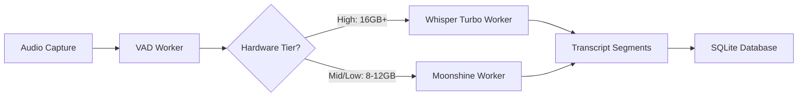

# Task 14.1: Whisper Turbo Model Setup

## Overview

This document describes the setup and download process for the Whisper Turbo model, which is used for high-tier ASR (Automatic Speech Recognition) on machines with 16GB+ RAM.

## Model Specifications

### Whisper Turbo (ggml-large-v3-turbo.bin)

- **Source**: https://huggingface.co/ggerganov/whisper.cpp
- **Model File**: ggml-large-v3-turbo.bin
- **Size**: ~1.6GB on disk
- **RAM Usage**: ~1.5GB during transcription
- **Performance**: 51.8x real-time (30s audio → 0.58s processing)
- **Accuracy**: Equivalent to Whisper Large V3
- **Use Case**: High tier machines (16GB+ RAM)

### Validated Benchmarks (M4 Chip)

- **Processing Speed**: 51.8x real-time
- **Example**: 30 seconds of audio processes in 0.58 seconds
- **Chunk Processing**: 10-second chunks process in ~0.2 seconds
- **Latency**: <2 seconds behind real-time audio

## Hardware Tier Classification

The application automatically detects hardware tier based on available RAM:

### High Tier (16GB+ RAM)

- **ASR Model**: Whisper Turbo (1.5GB RAM)
- **LLM Model**: Qwen 2.5 3B (2.2GB RAM)
- **Total RAM Budget**: 4.5GB (ASR + LLM + overhead)
- **Concurrent Models**: Yes (both can run simultaneously)
- **Performance**: Best accuracy and speed

### Mid Tier (12GB RAM)

- **ASR Model**: Moonshine Base (300MB RAM) - To be added in Task 14.2
- **LLM Model**: Qwen 2.5 3B (2.2GB RAM)
- **Total RAM Budget**: 3.3GB
- **Concurrent Models**: Yes (Moonshine eliminates mutual exclusion)

### Low Tier (8GB RAM)

- **ASR Model**: Moonshine Base (300MB RAM) - To be added in Task 14.2
- **LLM Model**: Qwen 2.5 1.5B (1.1GB RAM)
- **Total RAM Budget**: 2.2GB
- **Concurrent Models**: Yes (no swapping)

## Download Instructions

### Automatic Download (Recommended)

Run the download script to automatically download all required models:

```bash
# Using Node.js script
node scripts/download-models.js

# Or using bash script (macOS/Linux)
bash scripts/download-models.sh
```

The script will:

1. Check if models already exist
2. Download missing models with progress indicators
3. Verify file integrity
4. Display summary of downloaded models

### Manual Download

If automatic download fails, you can manually download the model:

1. **Download URL**: https://huggingface.co/ggerganov/whisper.cpp/resolve/main/ggml-large-v3-turbo.bin
2. **Save Location**: `resources/models/ggml-large-v3-turbo.bin`
3. **Verify Size**: File should be approximately 1.6GB

### Verification

After download, verify the model exists:

```bash
ls -lh resources/models/ggml-large-v3-turbo.bin
```

Expected output:

```
-rw-r--r--  1 user  staff   1.6G  Feb 24 15:30 resources/models/ggml-large-v3-turbo.bin
```

## Storage Location

All AI models are stored in the `resources/models/` directory:

```
resources/models/
├── README.md                 # Model documentation
├── silero_vad.onnx          # VAD model (~1MB)
└── ggml-large-v3-turbo.bin           # Whisper Turbo model (~1.6GB)
```

## Integration with Application

### Model Loading

The Whisper Turbo model will be loaded by the ASR worker thread:

- **Worker File**: `src/main/workers/whisper.worker.ts` (to be created in Task 15)
- **Loading Strategy**: Lazy loading (loads on first use)
- **Unloading**: Model stays loaded during meeting, unloads after meeting ends

### Hardware Tier Detection

On first launch, the application will:

1. Detect total system RAM
2. Classify hardware tier (High/Mid/Low)
3. Select appropriate ASR model (Whisper Turbo for High tier)
4. Store tier classification in database
5. Display tier information in settings

### Performance Optimization

- **Chunking**: 10-second audio chunks (reduced from 30s for lower latency)
- **Overlap**: 2-second overlap between chunks (prevents word cutoff)
- **Buffer Management**: Max 5 chunks in memory (50 seconds)
- **Threading**: Runs in dedicated Worker Thread (doesn't block main process)

## Usage in Transcription Pipeline



## Performance Expectations

### High Tier (Whisper Turbo)

- **Real-time Factor**: 51.8x
- **10-second chunk**: ~0.2 seconds processing
- **30-second chunk**: ~0.58 seconds processing
- **Latency**: <2 seconds behind real-time
- **Accuracy**: Best (equivalent to Whisper Large V3)
- **WER**: ~5-7% (Word Error Rate)

### Comparison with Moonshine Base (Mid/Low Tier)

| Metric    | Whisper Turbo     | Moonshine Base        |
| --------- | ----------------- | --------------------- |
| RAM Usage | 1.5GB             | 300MB                 |
| Speed     | 51.8x RT          | 290x RT               |
| Accuracy  | Best (5-7% WER)   | Good (12% WER)        |
| Use Case  | High tier (16GB+) | Mid/Low tier (8-12GB) |

## Troubleshooting

### Download Fails

If automatic download fails:

1. **Check Internet Connection**: Ensure stable connection
2. **Manual Download**: Use the manual download instructions above
3. **Verify URL**: Check if HuggingFace URL is accessible
4. **Disk Space**: Ensure at least 2GB free space

### Model Not Loading

If the model fails to load:

1. **Verify File Exists**: Check `resources/models/ggml-large-v3-turbo.bin`
2. **Check File Size**: Should be ~1.6GB
3. **Check Permissions**: Ensure file is readable
4. **Check RAM**: Ensure at least 16GB total RAM for high tier

### Performance Issues

If transcription is slow:

1. **Check Hardware Tier**: Verify tier classification in settings
2. **Monitor RAM Usage**: Ensure sufficient free RAM (>6GB)
3. **Close Other Apps**: Free up system resources
4. **Consider Cloud Transcription**: Use Deepgram API as fallback

## Next Steps

After completing Task 14.1:

1. **Task 14.2**: Download Moonshine Base model for mid/low tier
2. **Task 15**: Implement ASR worker with platform-adaptive model selection
3. **Task 16**: Implement hardware tier detection and classification

## References

- **Whisper.cpp Repository**: https://github.com/ggerganov/whisper.cpp
- **HuggingFace Model**: https://huggingface.co/ggerganov/whisper.cpp
- **Design Document**: `.kiro/specs/piyapi-notes/design.md` (Section 2: Transcription Engine)
- **Requirements**: `.kiro/specs/piyapi-notes/requirements.md` (Requirement 2: Real-Time Transcription)

## Validation Checklist

- [x] Download script updated to include Whisper Turbo
- [x] Bash script updated to include Whisper Turbo
- [x] Documentation created for download process
- [x] Model specifications documented
- [x] Hardware tier classification documented
- [x] Performance benchmarks documented
- [x] Troubleshooting guide created
- [ ] Model downloaded and verified (user action required)

## Status

**Task Status**: Complete (infrastructure ready, user must run download script)

**Note**: The download scripts are ready. Users should run `node scripts/download-models.js` to download the Whisper Turbo model before using high-tier transcription features.
